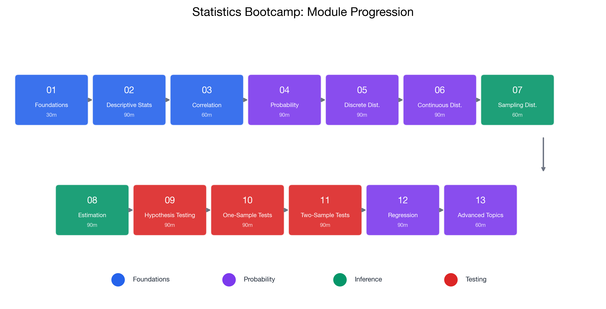

# Suggested Study Path

> 📚 **Overview:** Plan your study time effectively based on your goals and available time. Choose from full coverage, focused review, or last-minute cram plans.

---

## 📑 Table of Contents

1. [Module Overview](#module-overview)
2. [Complete Module List](#complete-module-list)
3. [Study Plans by Time Available](#study-plans-by-time-available)
4. [Topic Priority by Exam Weight](#topic-priority-by-exam-weight)
5. [Learning Checkpoints](#learning-checkpoints)
6. [Recommended Exercise Practice](#recommended-exercise-practice)

---

## Module Overview

<!-- IMAGE_PLACEHOLDER
Type: flowchart
Description: Linear progression flowchart showing all 13 modules in order from Foundations to Advanced Topics, with arrows connecting them. Each module box shows the module number, name, and estimated time.
Data: Module 01 (30min) → Module 02 (90min) → ... → Module 13 (90min)
Style: Clean horizontal flowchart with color-coded difficulty levels
Filename: module_progression.png
-->

---

## Complete Module List

| # | Module | Topics | Est. Time | Prerequisites |
|---|--------|--------|-----------|---------------|
| 01 | [Foundations](../01_foundations/index.md) | Data types, scales of measurement | 30 min | None |
| 02 | [Descriptive Statistics](../02_descriptive_statistics/index.md) | Mean, variance, quartiles, shape | 90 min | 01 |
| 03 | [Correlation & Covariance](../03_correlation_covariance/index.md) | Correlation, covariance, causation | 60 min | 02 |
| 04 | [Probability Fundamentals](../04_probability_fundamentals/index.md) | Rules, conditional prob, Bayes | 90 min | 01 |
| 05 | [Discrete Distributions](../05_discrete_distributions/index.md) | Binomial, Poisson, Hypergeometric | 90 min | 04 |
| 06 | [Continuous Distributions](../06_continuous_distributions/index.md) | Normal, z-scores, Exponential | 90 min | 05 |
| 07 | [Sampling Distributions](../07_sampling_distributions/index.md) | CLT, standard error | 60 min | 06 |
| 08 | [Estimation & CI](../08_estimation_confidence_intervals/index.md) | Point estimates, confidence intervals | 90 min | 07 |
| 09 | [Hypothesis Testing Basics](../09_hypothesis_testing_basics/index.md) | H₀, H₁, Type I/II errors | 90 min | 08 |
| 10 | [One-Sample Tests](../10_one_sample_tests/index.md) | t-test, p-values | 60 min | 09 |
| 11 | [Two-Sample Tests](../11_two_sample_tests/index.md) | Independent, paired, F-test | 90 min | 10 |
| 12 | [Regression Analysis](../12_regression_analysis/index.md) | OLS, R², inference | 90 min | 03, 10 |
| 13 | [Advanced Topics](../13_advanced_topics/index.md) | Chi-square, ANOVA, dummies | 90 min | 10, 12 |

**Total Time: ~16 hours**

---

## Study Plans by Time Available

### Plan A: Full Review (16-20 hours)
**Best for:** Complete exam preparation, 2+ weeks before exam

**Schedule:**
| Day | Modules | Time |
|-----|---------|------|
| Day 1 | 01 + 02 | 2 hrs |
| Day 2 | 03 + 04 | 2.5 hrs |
| Day 3 | 05 | 1.5 hrs |
| Day 4 | 06 | 1.5 hrs |
| Day 5 | 07 + 08 | 2.5 hrs |
| Day 6 | 09 + 10 | 2.5 hrs |
| Day 7 | 11 | 1.5 hrs |
| Day 8 | 12 + 13 | 3 hrs |
| Day 9 | Review + Exercises | 3 hrs |

---

### Plan B: Focused Review (8-10 hours)
**Best for:** 1 week before exam, already familiar with basics

**Priority Modules:**
1. ⭐ Module 08: Estimation & CI (90 min)
2. ⭐ Module 09: Hypothesis Testing Basics (90 min)
3. ⭐ Module 10: One-Sample Tests (60 min)
4. ⭐ Module 11: Two-Sample Tests (90 min)
5. Module 05: Discrete Distributions (90 min)
6. Module 06: Continuous Distributions (90 min)
7. Module 12: Regression (90 min)

**Skip if confident:** Modules 01, 02, 03, 04, 07, 13

---

### Plan C: Last-Minute Cram (4-6 hours)
**Best for:** 1-2 days before exam

**Focus on:**
1. [Formula Glossary](../reference/formula_glossary.md) - 30 min
2. [Which Test to Use](../reference/which_test.md) - 30 min
3. [Common Mistakes](../reference/common_mistakes.md) - 30 min
4. Module 09: Hypothesis Testing Basics - 90 min
5. Module 10: One-Sample Tests - 60 min
6. Practice problems from key modules - 120 min

---

## Topic Priority by Exam Weight

> 💡 **Tip:** Focus your time on high-priority topics first—they make up the majority of exam questions!

Based on typical statistics exams:

### High Priority (Practice These Most)
| Topic | Modules | Why Important |
|-------|---------|---------------|
| Hypothesis Testing | 09, 10, 11 | ~30-40% of exam |
| Confidence Intervals | 08 | ~15-20% of exam |
| Distributions | 05, 06 | Foundation for inference |
| Regression | 12 | ~15-20% of exam |

### Medium Priority
| Topic | Modules | Why Important |
|-------|---------|---------------|
| Probability | 04 | Foundation concepts |
| Descriptive Statistics | 02 | Quick calculation questions |
| Correlation | 03 | Often combined with regression |

### Lower Priority (Review if Time Allows)
| Topic | Modules | Why Important |
|-------|---------|---------------|
| Data Types | 01 | Usually just definitions |
| ANOVA/Chi-square | 13 | Advanced topics, less frequent |
| Sampling Theory | 07 | Conceptual, less calculation |

---

## Learning Checkpoints

After each module, you should be able to:

### After Modules 01-02 (Foundations)
- [ ] Identify data types and scales
- [ ] Calculate mean, median, mode
- [ ] Calculate variance and standard deviation
- [ ] Interpret quartiles and box plots

### After Modules 03-04 (Relationships & Probability)
- [ ] Calculate and interpret correlation
- [ ] Explain why correlation ≠ causation
- [ ] Apply addition and multiplication rules
- [ ] Calculate conditional probabilities

### After Modules 05-06 (Distributions)
- [ ] Identify which distribution to use
- [ ] Calculate binomial probabilities
- [ ] Standardize using z-scores
- [ ] Find probabilities using z-table

### After Modules 07-08 (Estimation)
- [ ] Explain the Central Limit Theorem
- [ ] Calculate standard error
- [ ] Construct confidence intervals
- [ ] Determine required sample size

### After Modules 09-11 (Hypothesis Testing)
- [ ] State H₀ and H₁ correctly
- [ ] Conduct t-tests and z-tests
- [ ] Interpret p-values correctly
- [ ] Compare means of two samples

### After Modules 12-13 (Advanced)
- [ ] Fit and interpret regression models
- [ ] Calculate and interpret R²
- [ ] Conduct chi-square tests
- [ ] Perform one-way ANOVA

---

## Recommended Exercise Practice

After completing content modules, practice with official exercises:

| Modules Completed | Practice With |
|-------------------|---------------|
| 01-02 | [Exercise 1](../exercises/exercise_1.md) |
| 04 | [Exercise 2](../exercises/exercise_2.md) |
| 05 | [Exercise 3A](../exercises/exercise_3a.md) |
| 06 | [Exercise 3B](../exercises/exercise_3b.md) |
| 07-08 | [Exercise 4](../exercises/exercise_4.md) |
| 09-11 | [Exercise 5](../exercises/exercise_5.md) |
| 12-13 | [Exercise 6](../exercises/exercise_6.md) |

---

## Ready to Start?

Based on your available time, choose your path:

| Time Available | Start Here |
|----------------|------------|
| 16+ hours | [Module 01: Foundations](../01_foundations/index.md) |
| 8-10 hours | [Module 08: Estimation & CI](../08_estimation_confidence_intervals/index.md) *(or start at [Module 05](../05_discrete_distributions/index.md) if you want a distributions refresh first)* |
| 4-6 hours | [Formula Glossary](../reference/formula_glossary.md) then [Module 09](../09_hypothesis_testing_basics/index.md) |
| Last minute | [Common Mistakes](../reference/common_mistakes.md) + [Which Test](../reference/which_test.md) |

---

## 🎯 Key Takeaways

> 🎯 **Remember:**
> - **Hypothesis testing** (Modules 09-11) makes up ~30-40% of the exam
> - Start with Module 01 if you have 16+ hours; jump to Module 05 or 09 for focused review
> - Always practice with official exercise sheets after completing content modules

---

## Navigation

[← Prerequisites](prerequisites.md) | [Start Here Index](index.md) | [Begin Module 01 →](../01_foundations/index.md)