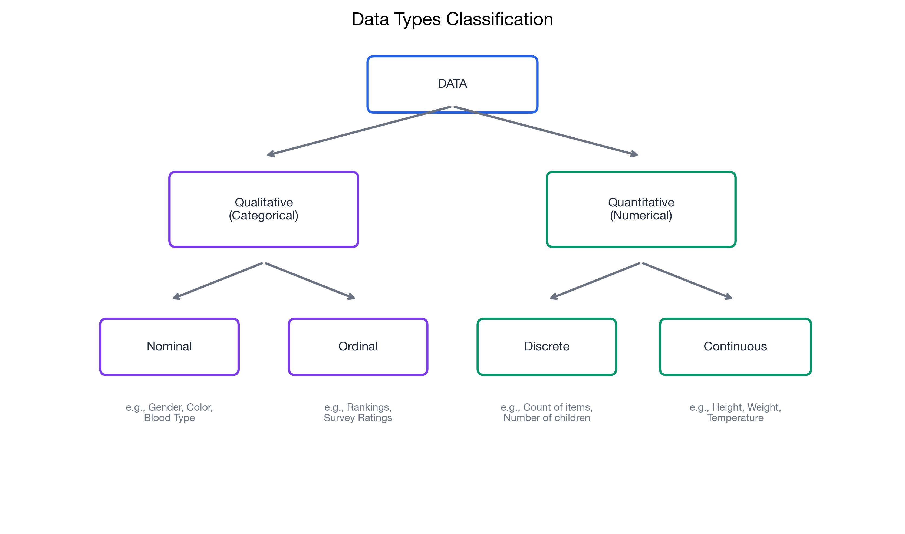

# I know the different types of data and their characteristics

> 📚 **Overview:** Understanding data types is the foundation of statistical analysis. Different types of data require different analytical approaches.

---

## 📑 Table of Contents

1. [Learning Objectives](#learning-objectives)
2. [Key Concepts](#key-concepts)
3. [Worked Example](#worked-example)
4. [Practice Problems](#practice-problems)
5. [Common Mistakes to Avoid](#common-mistakes-to-avoid)
6. [Key Takeaways](#key-takeaways)

---

## Learning Objectives

After completing this section, you will be able to:
- Distinguish between primary and secondary data
- Classify data as qualitative or quantitative
- Identify discrete vs. continuous data
- Understand the implications of data types for analysis

---

## Key Concepts

### Data by Source

#### Primary Data
Data that you collect yourself for a specific purpose.

**Characteristics:**
- Collected firsthand
- Tailored to your research question
- More control over quality
- Usually more expensive and time-consuming

**Examples:**
- Surveys you design and conduct
- Experiments you run
- Interviews you perform
- Observations you record

#### Secondary Data
Data that already exists, collected by someone else for another purpose.

**Characteristics:**
- Pre-existing
- May not perfectly fit your needs
- Usually faster and cheaper to obtain
- Quality may be uncertain

**Examples:**
- Government statistics (census data)
- Company financial reports
- Industry databases
- Published research datasets

---

### Data by Type

<!-- IMAGE_PLACEHOLDER
Type: diagram
Description: Hierarchical tree diagram showing data types classification: Data splits into Qualitative and Quantitative. Qualitative splits into Nominal and Ordinal. Quantitative splits into Discrete and Continuous.
Data: Clear labels at each level
Style: Clean tree structure with examples at leaf nodes
Filename: data_types_tree.png
-->

#### Qualitative (Categorical) Data
Data that describes qualities or categories, not measured numerically.

| Type | Description | Example |
|------|-------------|---------|
| **Nominal** | Categories without order | Colors, gender, country |
| **Ordinal** | Categories with meaningful order | Satisfaction ratings, education level |

#### Quantitative (Numerical) Data
Data that can be measured and expressed as numbers.

| Type | Description | Example |
|------|-------------|---------|
| **Discrete** | Countable, whole numbers | Number of customers, defects |
| **Continuous** | Can take any value in a range | Height, weight, temperature |

---

## Worked Example

**Problem:**
A company collects the following information about employees. Classify each variable by data type.

| Variable | Sample Value |
|----------|--------------|
| Department | Marketing |
| Years of experience | 7 |
| Performance rating | Excellent |
| Salary (CHF) | 85,000 |
| Employee ID | E12345 |
| Height (cm) | 175.5 |

**Solution:**

| Variable | Primary/Secondary | Qual/Quant | Specific Type |
|----------|-------------------|------------|---------------|
| Department | Primary | Qualitative | Nominal |
| Years of experience | Primary | Quantitative | Discrete |
| Performance rating | Primary | Qualitative | Ordinal |
| Salary (CHF) | Primary | Quantitative | Continuous* |
| Employee ID | Primary | Qualitative | Nominal |
| Height (cm) | Primary | Quantitative | Continuous |

*Note: While salary could be considered discrete (paid in cents), it's typically treated as continuous for analysis.

---

## Practice Problems

### Problem 1

A retail company tracks these metrics. Classify each:
- Store location (city name)
- Number of transactions per day
- Customer satisfaction score (1-5 stars)
- Average transaction value (CHF)
- Product category

💡 Show Solution

| Variable | Qual/Quant | Specific Type |
|----------|------------|---------------|
| Store location | Qualitative | Nominal |
| Number of transactions | Quantitative | Discrete |
| Satisfaction score (1-5) | Qualitative | Ordinal |
| Average transaction value | Quantitative | Continuous |
| Product category | Qualitative | Nominal |

---

### Problem 2

A hospital records patient data. Classify each:
- Blood type
- Body temperature (°C)
- Number of previous visits
- Pain level (0-10 scale)
- Insurance provider

💡 Show Solution

| Variable | Qual/Quant | Specific Type |
|----------|------------|---------------|
| Blood type | Qualitative | Nominal |
| Body temperature | Quantitative | Continuous |
| Number of previous visits | Quantitative | Discrete |
| Pain level (0-10) | Qualitative | Ordinal* |
| Insurance provider | Qualitative | Nominal |

*Pain level is ordinal because the intervals may not be equal (difference between 3 and 4 may not equal difference between 7 and 8).

---

### Problem 3

Which of the following are examples of secondary data for a market researcher studying consumer preferences?

a) Responses from a focus group you conducted
b) Government census data on household income
c) Survey results from a study published in a journal
d) Sales data your company already collected
e) Interviews with customers at a store

💡 Show Solution

**Secondary data:** b, c, d

- a) Primary - you conducted it yourself
- b) **Secondary** - collected by government
- c) **Secondary** - collected by other researchers
- d) **Secondary** - already exists, collected for other purposes
- e) Primary - you conducted it yourself

---

## Common Mistakes to Avoid

> ⚠️ **Mistake 1:** Treating ordinal data as interval/ratio.
> 
> Just because satisfaction is rated 1-5 doesn't mean the intervals are equal. "Very satisfied" (5) isn't necessarily twice as good as "Neutral" (2.5).

> ⚠️ **Mistake 2:** Confusing categorical numbers with quantitative data.
> 
> Employee ID "12345" is NOT quantitative data. The number is just a label.

> ⚠️ **Mistake 3:** Assuming all numerical data is continuous.
> 
> "Number of children" is discrete, even though it's a number.

---

## Key Takeaways

> 🎯 **Remember:**
> - **Primary data** = you collect it; **Secondary data** = already exists
> - **Qualitative data** describes categories; **Quantitative data** measures quantities
> - **Discrete** = countable; **Continuous** = measurable to any precision
> - Data type determines which statistical methods are appropriate

---

## Navigation

[← Module Index](index.md) | [Next: Scales of Measurement →](scales_of_measurement.md)

**Related Reference:** [Formula Glossary](../reference/formula_glossary.md)

