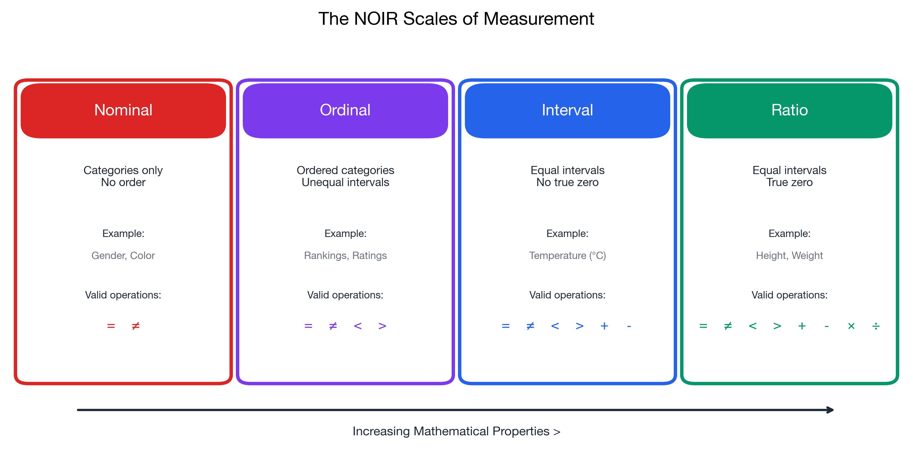

# I can identify and distinguish scales of measurement

> 📚 **Overview:** The scale of measurement determines what mathematical operations are meaningful for your data and which statistical methods you can apply.

---

## 📑 Table of Contents

1. [Learning Objectives](#learning-objectives)
2. [Key Concepts](#key-concepts)
3. [Summary Comparison](#summary-comparison)
4. [Worked Example](#worked-example)
5. [Practice Problems](#practice-problems)
6. [Application: Choosing the Right Statistic](#application-choosing-the-right-statistic)
7. [Key Takeaways](#key-takeaways)

---

## Learning Objectives

After completing this section, you will be able to:
- Identify the four scales of measurement (NOIR)
- Understand what operations are valid for each scale
- Choose appropriate statistics based on measurement scale
- Apply this knowledge to real-world examples

---

## Key Concepts

### The Four Scales: NOIR

Remember the acronym **NOIR** (French for "black"):
- **N**ominal
- **O**rdinal
- **I**nterval
- **R**atio

Each scale builds on the previous one, adding more mathematical properties.

---

### Nominal Scale

**Definition:** Categories with no inherent order or ranking.

**Properties:**
- Categories are mutually exclusive
- No meaningful order
- Can only count frequencies

**Valid Operations:**
- Equal (=) or not equal (≠)
- Mode (most frequent category)
- Frequency counts

**Examples:**
- Gender (Male, Female, Other)
- Blood type (A, B, AB, O)
- Country of origin
- Product categories
- Jersey numbers in sports

> 💡 **Tip:** If you can rearrange the categories without losing meaning, it's nominal.

---

### Ordinal Scale

**Definition:** Categories with a meaningful order, but unequal intervals.

**Properties:**
- Categories can be ranked
- Intervals between categories may not be equal
- "Greater than" and "less than" are meaningful

**Valid Operations:**
- Everything from nominal PLUS
- Greater than (>) and less than (<)
- Median, percentiles

**Examples:**
- Education level (High School < Bachelor's < Master's < PhD)
- Customer satisfaction (Very Unsatisfied → Very Satisfied)
- Movie ratings (★ to ★★★★★)
- Military ranks
- Likert scales (Strongly Disagree → Strongly Agree)

> ⚠️ **Warning:** You cannot assume equal intervals! The difference between "Satisfied" and "Very Satisfied" may not equal the difference between "Neutral" and "Satisfied."

---

### Interval Scale

**Definition:** Ordered categories with equal intervals, but no true zero point.

**Properties:**
- Equal intervals between values
- Zero is arbitrary (not absence of the property)
- Differences are meaningful
- Ratios are NOT meaningful

**Valid Operations:**
- Everything from ordinal PLUS
- Addition and subtraction
- Mean, standard deviation

**Examples:**
- Temperature in Celsius or Fahrenheit (0°C ≠ no temperature)
- Calendar years (Year 0 is arbitrary)
- IQ scores
- SAT/GMAT scores

> 💡 **Key insight:** 20°C is NOT "twice as hot" as 10°C. That's because 0°C is not the absence of heat.

---

### Ratio Scale

**Definition:** Equal intervals with a true zero point (zero means absence of the property).

**Properties:**
- True zero point exists
- All arithmetic operations are valid
- Ratios are meaningful

**Valid Operations:**
- Everything from interval PLUS
- Multiplication and division
- Geometric mean, coefficient of variation

**Examples:**
- Height, weight, distance
- Age (0 = not born yet)
- Income (0 = no income)
- Temperature in Kelvin (0K = absolute zero)
- Number of customers
- Time duration

> 💡 **Key insight:** 100 kg IS twice as heavy as 50 kg. This ratio statement is meaningful because 0 kg means no weight.

---

## Summary Comparison

| Scale | Order | Equal Intervals | True Zero | Valid Stats |
|-------|-------|-----------------|-----------|-------------|
| Nominal | ❌ | ❌ | ❌ | Mode, frequency |
| Ordinal | ✅ | ❌ | ❌ | + Median, percentiles |
| Interval | ✅ | ✅ | ❌ | + Mean, std dev |
| Ratio | ✅ | ✅ | ✅ | + Geometric mean, CV |

<!-- IMAGE_PLACEHOLDER
Type: chart
Description: Comparison chart showing the four NOIR scales arranged horizontally with increasing mathematical properties. Each scale shows its name, example, and which operations are valid (using checkmarks and x marks).
Data: Nominal (categories), Ordinal (rankings), Interval (equal spacing), Ratio (true zero)
Style: Clean infographic style with icons for each property
Filename: noir_scales_comparison.png
-->

---

## Worked Example

**Problem:**
A market research firm collects the following data. Identify the scale of measurement for each variable.

| Variable | Sample Values |
|----------|---------------|
| Age | 25, 34, 42, 56 |
| Brand preference | Nike, Adidas, Puma |
| Income bracket | Low, Medium, High |
| Temperature (°F) | 68, 72, 75, 80 |
| Number of purchases | 0, 1, 3, 7 |

**Solution:**

| Variable | Scale | Reasoning |
|----------|-------|-----------|
| Age | **Ratio** | True zero (0 = not born), can say "twice as old" |
| Brand preference | **Nominal** | Categories with no inherent order |
| Income bracket | **Ordinal** | Has order (Low < Medium < High), intervals unequal |
| Temperature (°F) | **Interval** | Equal intervals, but 0°F ≠ no temperature |
| Number of purchases | **Ratio** | True zero (0 = no purchases), counting data |

---

## Practice Problems

### Problem 1

Classify each variable by its scale of measurement:

a) Zip code
b) Military rank (Private, Sergeant, Lieutenant, Captain)
c) Reaction time in milliseconds
d) Year of birth
e) Number of siblings

💡 Show Solution

| Variable | Scale | Reasoning |
|----------|-------|-----------|
| a) Zip code | **Nominal** | Numbers are labels, no order |
| b) Military rank | **Ordinal** | Clear ranking, unequal intervals |
| c) Reaction time (ms) | **Ratio** | True zero (instant), can compare ratios |
| d) Year of birth | **Interval** | Equal intervals, Year 0 is arbitrary |
| e) Number of siblings | **Ratio** | True zero (0 = no siblings), countable |

---

### Problem 2

A survey asks: "How satisfied are you with our service?"
- 1 = Very Dissatisfied
- 2 = Dissatisfied  
- 3 = Neutral
- 4 = Satisfied
- 5 = Very Satisfied

A colleague calculates the mean score as 3.7 and says "Our average customer is 3.7 satisfied."

Is this analysis appropriate? Why or why not?

💡 Show Solution

**This analysis is questionable.**

The satisfaction scale is **ordinal**, not interval:
- We know 5 > 4 > 3 > 2 > 1
- But we don't know if the "distance" between 4 and 5 equals the distance between 2 and 3

**Problems with calculating the mean:**
- Treating it as interval assumes equal spacing
- "3.7 satisfied" has no clear meaning

**Better approaches:**
- Report the median (e.g., "Median satisfaction = 4 (Satisfied)")
- Report frequencies (e.g., "65% rated 4 or 5")
- Report the mode (e.g., "Most common rating was 4")

**However:** In practice, many researchers do treat Likert scales as interval, especially with 5+ categories. This is a simplifying assumption and should be acknowledged.

---

### Problem 3

Which of the following statements are mathematically valid?

a) "The average temperature this week was 15°C"
b) "Today is twice as hot as yesterday" (comparing 30°C to 15°C)
c) "Customer A spent twice as much as Customer B" (CHF 200 vs CHF 100)
d) "The median education level is Bachelor's degree"
e) "The mean blood type is AB"

💡 Show Solution

| Statement | Valid? | Reasoning |
|-----------|--------|-----------|
| a) Average temp = 15°C | **Yes** | Interval scale allows mean |
| b) Twice as hot | **No** | Celsius is interval, not ratio; ratios not meaningful |
| c) Twice the spending | **Yes** | Money is ratio scale; ratios are meaningful |
| d) Median education | **Yes** | Ordinal scale allows median |
| e) Mean blood type | **No** | Nominal scale; mean is not meaningful |

---

## Application: Choosing the Right Statistic

| If your data is... | Use these central tendency measures | Use these dispersion measures |
|--------------------|-------------------------------------|-------------------------------|
| Nominal | Mode only | - |
| Ordinal | Mode, Median | Range, IQR |
| Interval | Mode, Median, Mean | Range, IQR, Std Dev, Variance |
| Ratio | Mode, Median, Mean, Geometric Mean | Range, IQR, Std Dev, Variance, CV |

---

## Key Takeaways

> 🎯 **Remember:**
> - **Nominal:** Categories only, use mode and frequencies
> - **Ordinal:** Order matters, use median and percentiles
> - **Interval:** Equal spacing, use mean and standard deviation
> - **Ratio:** True zero, all operations valid including ratios
> - **Remember NOIR** to recall the hierarchy
> - Higher scales can use all statistics from lower scales

---

## Navigation

[← Data Types](data_types.md) | [Module Index](index.md) | [Next Module: Descriptive Statistics →](../02_descriptive_statistics/index.md)

**Related Reference:** [Formula Glossary](../reference/formula_glossary.md)

