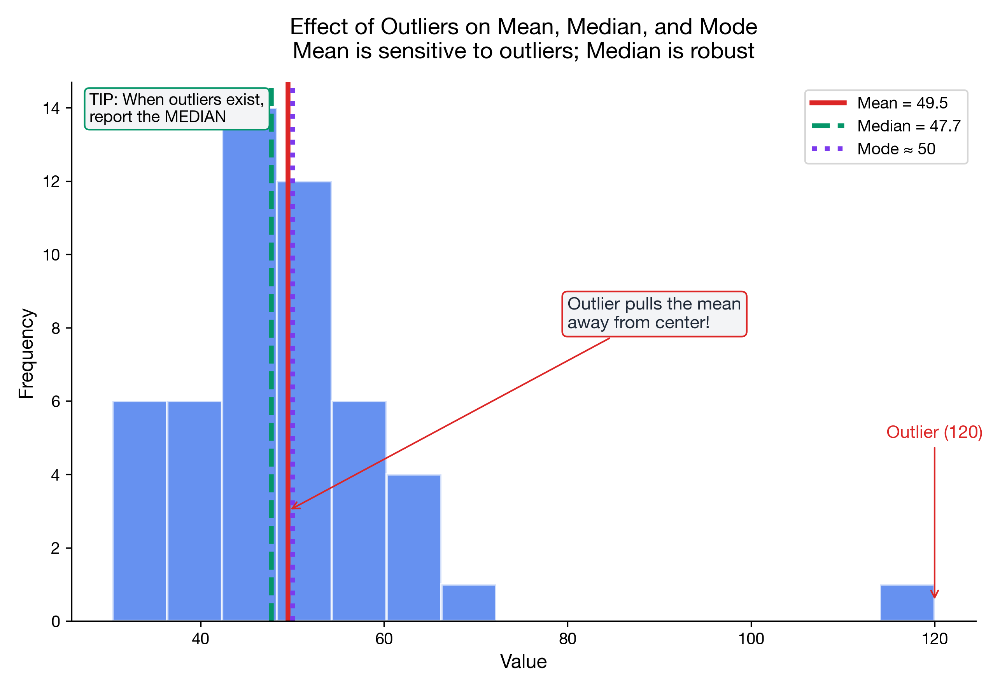

# I can calculate and interpret the mean, median, and mode

> 📚 **Overview:** These three measures describe the "center" of your data, but each captures a different aspect. Learn when to use each one.

---

## 📑 Table of Contents

1. [Learning Objectives](#learning-objectives)
2. [Key Concepts](#key-concepts)
3. [Comparison](#comparison)
4. [Worked Example](#worked-example)
5. [Practice Problems](#practice-problems)
6. [Common Mistakes to Avoid](#common-mistakes-to-avoid)
7. [Key Takeaways](#key-takeaways)

---

## Learning Objectives

After completing this section, you will be able to:
- Calculate the arithmetic mean for a dataset
- Find the median of ordered data
- Identify the mode of a dataset
- Choose the appropriate measure based on data characteristics

---

## Key Concepts

### Arithmetic Mean

The **mean** (average) is the sum of all values divided by the count.

**Formula (Sample Mean):**

$$
\bar{x} = \frac{1}{n}\sum_{i=1}^{n} x_i = \frac{x_1 + x_2 + ... + x_n}{n}
$$

**Properties:**
- Uses all data points
- Sensitive to outliers
- Best for symmetric distributions
- Works with interval and ratio data

**When to Use:**
- Data is roughly symmetric
- No extreme outliers
- You need to perform further calculations

---

### Median

The **median** is the middle value when data is ordered.

**Calculation:**
1. Sort the data in ascending order
2. If n is odd: median = middle value
3. If n is even: median = average of two middle values

**Formulas:**
- If n is odd: median = value at position (n+1)/2
- If n is even: median = average of values at positions n/2 and (n/2)+1

**Properties:**
- Not affected by outliers (robust)
- Uses only the middle value(s)
- Works with ordinal, interval, and ratio data

**When to Use:**
- Data is skewed
- Outliers are present
- Data is ordinal

---

### Mode

The **mode** is the most frequently occurring value.

**Properties:**
- Can have multiple modes (bimodal, multimodal)
- Can have no mode (all values unique)
- Works with all data types, including nominal

**When to Use:**
- Categorical data
- Looking for the "typical" category
- Complementing mean/median analysis

---

## Comparison

| Measure | Sensitivity to Outliers | Data Type | When to Use |
|---------|------------------------|-----------|-------------|
| Mean | High | Interval, Ratio | Symmetric data, no outliers |
| Median | Low (robust) | Ordinal, Interval, Ratio | Skewed data, outliers present |
| Mode | None | All types | Categorical data, finding typical value |

---

## Worked Example

**Problem:**
A company recorded the following daily sales (in thousands CHF) for 10 days:
12, 15, 18, 14, 12, 22, 16, 14, 12, 85

Calculate the mean, median, and mode. Which measure best represents the typical sales day?

**Solution:**

### Step 1: Calculate the Mean

$$
\bar{x} = \frac{12 + 15 + 18 + 14 + 12 + 22 + 16 + 14 + 12 + 85}{10}
$$

$$
\bar{x} = \frac{220}{10} = 22.0 \text{ thousand CHF}
$$

### Step 2: Calculate the Median

First, sort the data:
12, 12, 12, 14, 14, 15, 16, 18, 22, 85

Since n = 10 (even), median = average of 5th and 6th values:

$$
\tilde{x} = \frac{14 + 15}{2} = 14.5 \text{ thousand CHF}
$$

### Step 3: Identify the Mode

Value 12 appears 3 times (most frequent)

**Mode = 12 thousand CHF**

### Step 4: Interpretation

| Measure | Value | Comment |
|---------|-------|---------|
| Mean | 22.0 | Inflated by the outlier (85) |
| Median | 14.5 | Not affected by outlier |
| Mode | 12.0 | Most common sales day |

**Conclusion:** The **median (14.5)** best represents typical sales because the data has an extreme outlier (85). The mean is pulled up by this unusual day.

---

## Practice Problems

### Problem 1

Calculate the mean, median, and mode for this dataset:
8, 12, 15, 12, 18, 12, 20, 22

💡 Show Solution

**Mean:**

$$
\bar{x} = \frac{8 + 12 + 15 + 12 + 18 + 12 + 20 + 22}{8} = \frac{119}{8} = 14.875
$$

**Median:**
Sorted: 8, 12, 12, 12, 15, 18, 20, 22
n = 8 (even), so median = (12 + 15) / 2 = **13.5**

**Mode:**
12 appears 3 times → **Mode = 12**

---

### Problem 2

A professor's exam scores are: 45, 78, 82, 85, 88, 90, 91, 92, 93, 95

Which measure of central tendency would you report, and why?

💡 Show Solution

**Calculations:**
- Mean = (45 + 78 + 82 + 85 + 88 + 90 + 91 + 92 + 93 + 95) / 10 = 839/10 = **83.9**
- Median: Sorted data, n=10, median = (88 + 90)/2 = **89**
- Mode: No repeated values, **no mode**

**Recommendation:** 
Report the **median (89)** because there's a low outlier (45) that pulls the mean down. The median better represents the "typical" student performance.

Alternatively, report both: "Median score was 89, but the mean was 83.9 due to one very low score."

---

### Problem 3

A shoe store tracks shoe sizes sold in a day:
8, 9, 10, 9, 11, 8, 9, 10, 9, 8, 9, 12, 9, 10, 9

What is the most useful measure of central tendency for inventory planning?

💡 Show Solution

**Mode = 9** (appears 7 times)

For inventory planning, the **mode** is most useful because:
- It tells you the most commonly purchased size
- You should stock more of size 9 shoes
- Mean (9.47) and median (9) don't help with ordering discrete sizes

**Complete analysis:**
- Mode = 9 (7 occurrences)
- Median = 9 (middle of 15 values)
- Mean = 9.47

---

## Common Mistakes to Avoid

> ⚠️ **Mistake 1:** Forgetting to sort data before finding the median.
> Always arrange values in order first!

> ⚠️ **Mistake 2:** Using the mean when there are outliers.
> Check for outliers first; use median if they exist.

> ⚠️ **Mistake 3:** Confusing "no mode" with "mode = 0."
> If all values appear once, there is no mode (not mode = 0).

---

## Key Takeaways

> 🎯 **Remember:**
> - **Mean:** Sum divided by count; sensitive to outliers
> - **Median:** Middle value when sorted; robust to outliers
> - **Mode:** Most frequent value; works for all data types
> - Choose based on data shape and presence of outliers
> - When in doubt, report multiple measures

---

## Quick Reference

| Measure | Formula | Best For |
|---------|---------|----------|
| Mean | x̄ = (Σxᵢ) / n | Symmetric, no outliers |
| Median | Middle value (sorted) | Skewed, outliers |
| Mode | Most frequent | Categorical, inventory |

---

## Navigation

[← Module Index](index.md) | [Next: Variance & Std Dev →](variance_stddev.md)

**Related Reference:** [Formula Glossary](../reference/formula_glossary.md)

