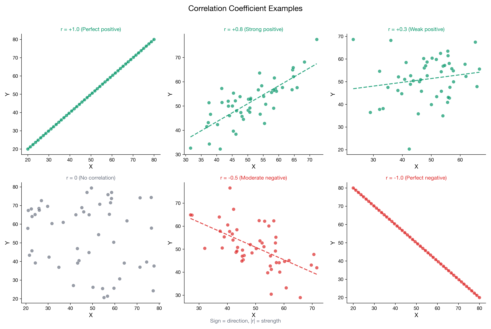

# I can calculate and interpret correlation

> 📚 **Overview:** The correlation coefficient is a standardized measure of the strength and direction of a linear relationship—the most common measure of association.

---

## 📑 Table of Contents

1. [Learning Objectives](#learning-objectives)
2. [Key Concepts](#key-concepts)
3. [Worked Example](#worked-example)
4. [Practice Problems](#practice-problems)
5. [Coefficient of Determination](#coefficient-of-determination-r²)
6. [Common Mistakes to Avoid](#common-mistakes-to-avoid)
7. [Key Takeaways](#key-takeaways)

---

## Learning Objectives

After completing this section, you will be able to:
- Calculate the Pearson correlation coefficient
- Interpret correlation values correctly
- Understand the properties and limitations of correlation
- Distinguish between strong, moderate, and weak correlations

---

## Key Concepts

### Pearson Correlation Coefficient

The **correlation coefficient (r)** standardizes covariance by dividing by the product of standard deviations.

$$
r = \frac{s_{xy}}{s_x \cdot s_y}
$$

Or expanded:

$$
r = \frac{\sum_{i=1}^{n}(x_i - \bar{x})(y_i - \bar{y})}{\sqrt{\sum_{i=1}^{n}(x_i - \bar{x})^2 \cdot \sum_{i=1}^{n}(y_i - \bar{y})^2}}
$$

---

### Properties of Correlation

1. **Range:** -1 ≤ r ≤ 1
2. **Unit-free:** No units, can compare across different scales
3. **Symmetric:** rₓᵧ = rᵧₓ
4. **Measures LINEAR relationships only**

---

### Interpreting Correlation Values

| Value of r | Strength | Direction |
|------------|----------|-----------|
| r = 1 | Perfect | Positive |
| 0.7 ≤ r < 1 | Strong | Positive |
| 0.4 ≤ r < 0.7 | Moderate | Positive |
| 0 < r < 0.4 | Weak | Positive |
| r = 0 | None | None |
| -0.4 < r < 0 | Weak | Negative |
| -0.7 < r ≤ -0.4 | Moderate | Negative |
| -1 < r ≤ -0.7 | Strong | Negative |
| r = -1 | Perfect | Negative |

<!-- IMAGE_PLACEHOLDER
Type: scatter_grid
Description: A 3x3 grid of scatter plots showing different correlation values: r=-1, r=-0.7, r=-0.3 (top row); r=0, r=0.3, r=0.7 (middle row); r=0.9, r=1, and a non-linear example (bottom row). Each plot labeled with its r value.
Data: Synthetic data matching each correlation level
Style: Grid format with r values as titles
Filename: correlation_examples.png
-->

---

## Worked Example

**Problem:**
Using the advertising and sales data from the previous section, calculate the correlation coefficient.

| Month | Advertising (X) | Sales (Y) |
|-------|-----------------|-----------|
| 1 | 10 | 100 |
| 2 | 15 | 120 |
| 3 | 12 | 110 |
| 4 | 18 | 140 |
| 5 | 20 | 150 |
| 6 | 13 | 115 |

**Given from previous calculation:**
- $\bar{x} = 14.67$, $\bar{y} = 122.5$
- $s_{xy} = 71.00$

**Solution:**

### Step 1: Calculate Standard Deviation of X

| $x_i$ | $(x_i - \bar{x})^2$ |
|-------|---------------------|
| 10 | 21.81 |
| 15 | 0.11 |
| 12 | 7.13 |
| 18 | 11.09 |
| 20 | 28.41 |
| 13 | 2.79 |
| **Σ** | **71.34** |

$$
s_x = \sqrt{\frac{71.34}{5}} = \sqrt{14.27} = 3.78
$$

### Step 2: Calculate Standard Deviation of Y

| $y_i$ | $(y_i - \bar{y})^2$ |
|-------|---------------------|
| 100 | 506.25 |
| 120 | 6.25 |
| 110 | 156.25 |
| 140 | 306.25 |
| 150 | 756.25 |
| 115 | 56.25 |
| **Σ** | **1787.50** |

$$
s_y = \sqrt{\frac{1787.50}{5}} = \sqrt{357.5} = 18.91
$$

### Step 3: Calculate Correlation

$$
r = \frac{s_{xy}}{s_x \cdot s_y} = \frac{71.00}{3.78 \times 18.91} = \frac{71.00}{71.48} = 0.993
$$

### Interpretation

**r = 0.993** indicates a **very strong positive correlation**.

- The relationship is almost perfectly linear
- As advertising spend increases, sales increase proportionally
- About 99% of the variation in sales can be explained by advertising (r² = 0.986)

---

## Practice Problems

### Problem 1

Calculate the correlation coefficient for the study hours and exam scores data:

| Student | Hours (X) | Score (Y) |
|---------|-----------|-----------|
| A | 2 | 65 |
| B | 4 | 75 |
| C | 3 | 70 |
| D | 5 | 85 |
| E | 6 | 90 |

Given: sₓᵧ = 16.25, x̄ = 4, ȳ = 77

💡 Show Solution

**Step 1: Calculate sₓ**

| X | $(X-4)^2$ |
|---|-----------|
| 2 | 4 |
| 4 | 0 |
| 3 | 1 |
| 5 | 1 |
| 6 | 4 |
| Σ | 10 |

$$
s_x = \sqrt{\frac{10}{4}} = \sqrt{2.5} = 1.58
$$

**Step 2: Calculate $s_y$**

| Y | $(Y-77)^2$ |
|---|------------|
| 65 | 144 |
| 75 | 4 |
| 70 | 49 |
| 85 | 64 |
| 90 | 169 |
| Σ | 430 |

$$
s_y = \sqrt{\frac{430}{4}} = \sqrt{107.5} = 10.37
$$

**Step 3: Calculate r**

$$
r = \frac{16.25}{1.58 \times 10.37} = \frac{16.25}{16.38} = 0.992
$$

**Interpretation:** Very strong positive correlation between study hours and exam scores.

---

### Problem 2

A researcher finds a correlation of r = -0.85 between hours of TV watched per day and physical fitness score.

a) Describe the relationship
b) What does the negative sign indicate?
c) How strong is the relationship?

💡 Show Solution

**a) Description:**
There is a strong negative linear relationship between TV watching and physical fitness.

**b) Negative sign indicates:**
- As one variable increases, the other tends to decrease
- More TV watching is associated with lower fitness scores
- Less TV watching is associated with higher fitness scores

**c) Strength:**
- |r| = 0.85, which is in the "strong" range (0.7 to 1.0)
- The relationship is quite consistent
- r² = 0.72, meaning 72% of fitness variation is associated with TV watching

**Note:** This does NOT mean TV causes low fitness. There could be other explanations.

---

### Problem 3

Which correlation indicates a stronger relationship: r = -0.75 or r = 0.60?

💡 Show Solution

**r = -0.75** indicates a stronger relationship.

Strength is determined by the **absolute value** of r:
- |r = -0.75| = 0.75
- |r = 0.60| = 0.60

Since 0.75 > 0.60, the relationship with r = -0.75 is stronger.

The sign only indicates direction:
- r = -0.75: Strong negative relationship
- r = 0.60: Moderate positive relationship

---

## Coefficient of Determination (r²)

The **coefficient of determination** is the square of the correlation coefficient.

$$
r^2 = \text{(proportion of variance explained)}
$$

**Interpretation:**
- r² tells you what proportion of Y's variance can be "explained by" X
- If r = 0.8, then r² = 0.64, meaning 64% of Y's variation is associated with X

| r | r² | Interpretation |
|---|-----|----------------|
| ±0.9 | 0.81 | 81% of variance explained |
| ±0.7 | 0.49 | 49% of variance explained |
| ±0.5 | 0.25 | 25% of variance explained |
| ±0.3 | 0.09 | 9% of variance explained |

---

## Common Mistakes to Avoid

> ⚠️ **Mistake 1:** Interpreting correlation as causation.
> r = 0.9 does NOT mean X causes Y.

> ⚠️ **Mistake 2:** Using correlation for non-linear relationships.
> Correlation measures LINEAR relationships only. A curved pattern can have r ≈ 0.

> ⚠️ **Mistake 3:** Ignoring outliers.
> A single outlier can dramatically change correlation.

> ⚠️ **Mistake 4:** Assuming r = 0 means no relationship.
> It means no LINEAR relationship; there could be a curved relationship.

---

## Key Takeaways

> 🎯 **Remember:**
> - **Correlation (r)** ranges from -1 to +1
> - **Sign** indicates direction; **magnitude** indicates strength
> - **r²** tells you proportion of variance explained
> - Always **plot your data** to check for non-linear patterns
> - **Correlation ≠ Causation** (next section)

---

## Navigation

[← Covariance](covariance.md) | [Module Index](index.md) | [Next: Correlation vs Causation →](correlation_causation.md)

**Related Reference:** [Formula Glossary](../reference/formula_glossary.md)

