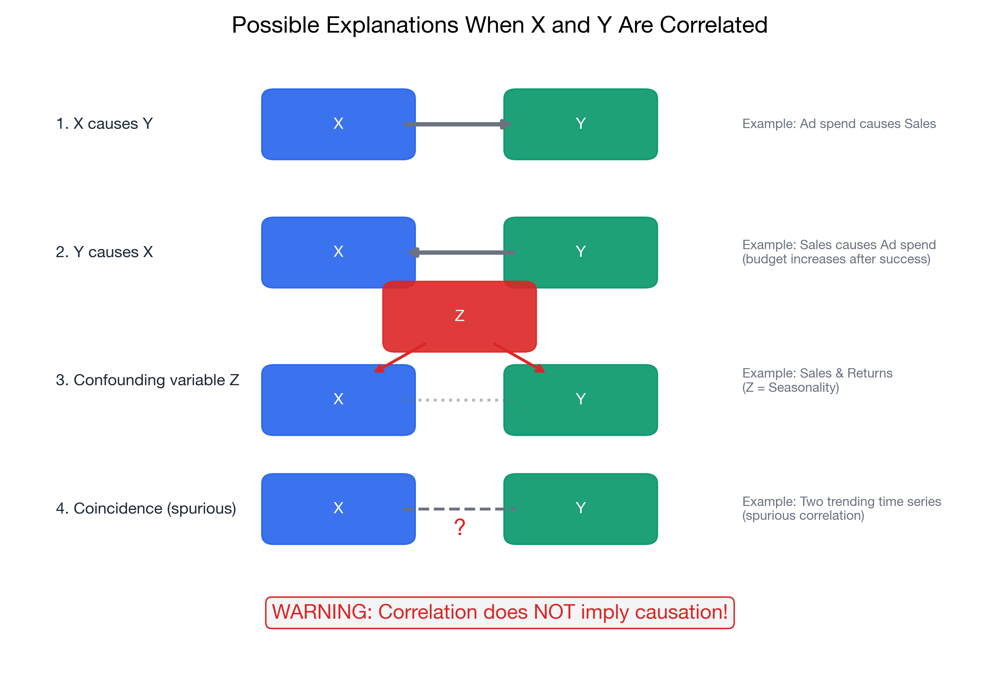

# I understand why correlation does not imply causation

> 📚 **Overview:** One of the most important concepts in statistics: a relationship between variables does NOT mean one causes the other. Learn to think critically about statistical claims.

---

## 📑 Table of Contents

1. [Learning Objectives](#learning-objectives)
2. [Key Concepts](#key-concepts)
3. [Famous Examples](#famous-examples)
4. [Practice Problems](#practice-problems)
5. [What's Needed for Causation?](#whats-needed-for-causation)
6. [Common Mistakes to Avoid](#common-mistakes-to-avoid)
7. [Key Takeaways](#key-takeaways)

---

## Learning Objectives

After completing this section, you will be able to:
- Explain why correlation doesn't prove causation
- Identify alternative explanations for correlations
- Recognize common examples of spurious correlations
- Understand what's needed to establish causation

---

## Key Concepts

### The Core Principle

> ⚠️ **Correlation does NOT imply causation.**

Finding a statistical relationship between X and Y does NOT prove that:
- X causes Y, OR
- Y causes X

There are always alternative explanations.

---

### Three Alternative Explanations

When we observe a correlation between X and Y, there are several possibilities:

<!-- IMAGE_PLACEHOLDER
Type: diagram
Description: Diagram showing four possible explanations for X-Y correlation: (1) X causes Y (arrow from X to Y), (2) Y causes X (arrow from Y to X), (3) Confounding variable Z causes both (Z pointing to both X and Y), (4) Coincidence/spurious correlation (no arrows, just random pattern).
Data: Simple arrow diagrams for each scenario
Style: Clean, labeled boxes with arrows
Filename: causation_explanations.png
-->

#### 1. Reverse Causation
Maybe Y causes X, not X causes Y.

**Example:** 
- Correlation: Countries with more cars have higher GDP
- Claim: Cars cause economic growth
- Reverse: Economic growth allows people to buy cars

#### 2. Confounding Variable (Third Variable)
A hidden variable Z causes both X and Y.

**Example:**
- Correlation: Ice cream sales and drowning deaths
- Claim: Ice cream causes drowning?
- Confound: Summer heat causes both (more ice cream AND more swimming)

#### 3. Coincidence (Spurious Correlation)
Random chance produces apparent patterns with no real connection.

**Example:**
- Correlation: Nicolas Cage films and swimming pool drownings
- Reality: Pure coincidence, no causal mechanism

---

## Famous Examples

### Ice Cream and Drowning

| Month | Ice Cream Sales | Drowning Deaths |
|-------|-----------------|-----------------|
| June | High | High |
| July | Very High | Very High |
| December | Low | Low |
| January | Low | Low |

**Correlation:** Positive, quite strong

**Confounding variable:** Temperature/Season
- Hot weather → more ice cream sales
- Hot weather → more swimming → more drownings

**NOT:** Ice cream causes drowning!

---

### Firefighters and Fire Damage

| Fire | Firefighters Sent | Damage ($) |
|------|-------------------|------------|
| Small | Few | Low |
| Medium | Moderate | Moderate |
| Large | Many | High |

**Correlation:** Positive (more firefighters = more damage)

**Confounding variable:** Fire size
- Bigger fires → more firefighters sent
- Bigger fires → more damage

**NOT:** Firefighters cause damage!

---

### Education and Income

| Person | Education | Income |
|--------|-----------|--------|
| Type A | High | High |
| Type B | Low | Low |

**Correlation:** Positive

**But is it causal?** Possibly, but there are confounds:
- Family wealth → affords education AND provides opportunities
- Natural ability → success in school AND success at work
- Social connections → access to good schools AND good jobs

**The relationship is real, but the mechanism is complex.**

---

## Practice Problems

### Problem 1

A study finds a positive correlation between coffee consumption and lifespan. The headline reads: "Coffee Makes You Live Longer!"

What alternative explanations should we consider?

💡 Show Solution

**Alternative explanations:**

1. **Reverse causation:** Healthy people may be more likely to drink coffee (those with heart conditions may avoid it)

2. **Confounding variables:**
   - Income: Wealthier people can afford coffee AND better healthcare
   - Social activity: Coffee drinkers may be more social, which improves health
   - Work status: Employed people drink more coffee AND have income for health

3. **Survivor bias:** Only healthy people survive long enough to be in the study

4. **Healthy user effect:** People who drink moderate amounts of coffee may also follow other healthy behaviors

**Conclusion:** The correlation could be real, but the headline is misleading without controlled experiments.

---

### Problem 2

Data shows that students who eat breakfast have higher test scores than those who skip breakfast.

Design a study that would better establish causation.

💡 Show Solution

**Ideal study: Randomized Controlled Trial (RCT)**

**Design:**
1. **Random assignment:** Randomly assign students to:
   - Treatment group: Must eat breakfast
   - Control group: Must skip breakfast

2. **Control confounds:**
   - Same test, same time
   - Control for sleep, prior grades, SES
   - Blind graders to group assignment

3. **Measure outcomes:** Compare test scores between groups

**Why this works:**
- Random assignment ensures groups are similar on average
- Differences can be attributed to breakfast, not confounds
- Eliminates reverse causation (breakfast assigned, not chosen)

**Practical issues:**
- Ethical concerns about forcing students to skip breakfast
- Compliance with assigned condition
- May not reflect real-world behavior

---

### Problem 3

A politician claims: "States with more gun laws have higher crime rates. Therefore, gun laws cause crime!"

Identify the logical flaw and suggest alternative explanations.

💡 Show Solution

**Logical flaw:** Assuming correlation implies causation

**Alternative explanations:**

1. **Reverse causation:** States with high crime PASS more gun laws in response to crime. Laws don't cause crime; crime causes laws.

2. **Confounding variables:**
   - Urban density: More urban states have more crime AND more laws
   - Poverty: High-poverty states may have more crime AND react with legislation
   - Historical factors: Regional differences in crime and legislation

3. **Selection bias:** Comparing states at one point in time ignores trends. A state might have passed laws and seen crime decrease from even higher levels.

**Better analysis would:**
- Compare crime rates before and after laws
- Control for confounding variables
- Use similar states as controls

---

## What's Needed for Causation?

### The Gold Standard: Randomized Controlled Trial (RCT)

To establish causation, you ideally need:

1. **Random assignment** - Subjects randomly placed in groups
2. **Control group** - Comparison without the treatment
3. **Manipulation** - Actively change the suspected cause
4. **Control confounds** - Hold other factors constant

### When RCTs Aren't Possible

Sometimes experiments are unethical or impractical. In those cases, look for:

1. **Time sequence** - Cause must precede effect
2. **Dose-response** - More cause → more effect
3. **Plausible mechanism** - A logical reason why X would cause Y
4. **Consistency** - Same result across different studies
5. **Ruling out alternatives** - Statistical controls for confounds

---

## Correlation CAN Be Useful

Even without proving causation, correlation is valuable:

- **Prediction:** Can predict Y from X even without knowing why
- **Hypothesis generation:** Suggests what to test experimentally
- **Screening:** Identifies potential risk factors
- **Description:** Characterizes relationships in data

---

## Common Mistakes to Avoid

> ⚠️ **Mistake 1:** "Correlation is useless if it's not causation."
> Correlation is still valuable for prediction and hypothesis generation.

> ⚠️ **Mistake 2:** "We controlled for some variables, so now it's causal."
> You can never control for ALL possible confounds with observational data.

> ⚠️ **Mistake 3:** "The correlation is very strong, so it must be causal."
> Even r = 0.99 doesn't imply causation. Ice cream and drowning could correlate at 0.95.

---

## Key Takeaways

> 🎯 **Remember:**
> - **Correlation ≠ Causation** - Always consider alternatives
> - **Reverse causation:** Maybe Y causes X
> - **Confounding:** A third variable Z affects both
> - **Spurious correlation:** Sometimes it's just coincidence
> - **RCTs** are the gold standard for establishing causation
> - **Correlation is still useful** for prediction and generating hypotheses

---

## Quick Checklist: Evaluating Causal Claims

When someone claims X causes Y based on correlation:
- [ ] Could Y cause X instead?
- [ ] Is there a confounding variable Z?
- [ ] Is there a plausible mechanism?
- [ ] Does the time sequence make sense?
- [ ] Has the relationship been replicated?
- [ ] Has a controlled experiment been done?

---

## Navigation

[← Correlation](correlation.md) | [Module Index](index.md) | [Next Module: Probability →](../04_probability_fundamentals/index.md)

**Related Reference:** [Common Mistakes](../reference/common_mistakes.md)

