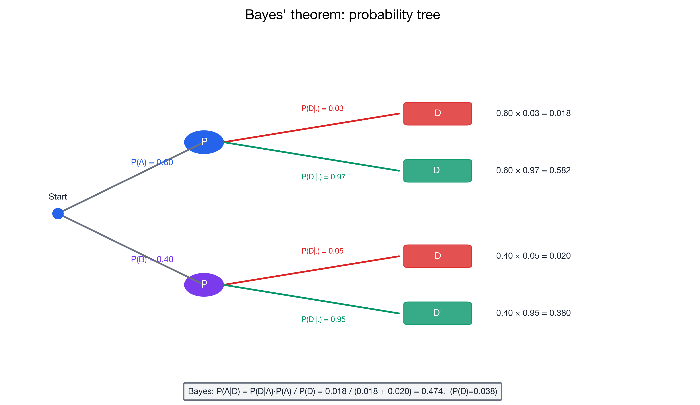

# I can apply Bayes' theorem

> 📚 **Overview:** Bayes' theorem lets us update probabilities when we get new information—powerful for reversing conditional probabilities.

---

## 📑 Table of Contents

1. [Learning Objectives](#learning-objectives)
2. [Key Concepts](#key-concepts)
3. [Worked Example](#worked-example)
4. [Probability Tree Method](#probability-tree-method)
5. [Practice Problems](#practice-problems)
6. [Key Takeaways](#key-takeaways)

---

## Learning Objectives

After completing this section, you will be able to:
- Apply Bayes' theorem to calculate reverse conditional probabilities
- Understand prior, likelihood, and posterior probabilities
- Solve practical problems using Bayes' theorem
- Build probability trees for multi-stage problems

---

## Key Concepts

### Bayes' Theorem Formula

$$
P(A|B) = \frac{P(B|A) \cdot P(A)}{P(B)}
$$

**Expanded form using Law of Total Probability:**

$$
P(A|B) = \frac{P(B|A) \cdot P(A)}{P(B|A) \cdot P(A) + P(B|A') \cdot P(A')}
$$

---

### Terminology

| Term | Meaning | In Formula |
|------|---------|------------|
| **Prior** | Initial probability before new evidence | P(A) |
| **Likelihood** | Probability of evidence given hypothesis | P(B\|A) |
| **Posterior** | Updated probability after evidence | P(A\|B) |
| **Evidence** | New information we observe | B |

---

### When to Use Bayes' Theorem

Use when you know P(B|A) but need P(A|B).

**Common scenarios:**
- Medical diagnosis: Know test accuracy, need probability of disease
- Quality control: Know defect rates, need probability given test result
- Spam filtering: Know word frequencies, need probability of spam

---

## Worked Example

**Problem:**
A company manufactures parts at two plants:
- Plant A produces 60% of parts, with 3% defective
- Plant B produces 40% of parts, with 5% defective

A randomly selected part is defective. What's the probability it came from Plant A?

**Solution:**

### Step 1: Define Events
- A = Part from Plant A
- B = Part from Plant B (= A')
- D = Part is defective

### Step 2: List Known Probabilities
- P(A) = 0.60, P(B) = 0.40
- P(D|A) = 0.03, P(D|B) = 0.05

### Step 3: Apply Bayes' Theorem

We want P(A|D):

$$P(A|D) = \frac{P(D|A) \cdot P(A)}{P(D|A) \cdot P(A) + P(D|B) \cdot P(B)}$$

### Step 4: Calculate Denominator (Total P(D))

$$P(D) = 0.03 \times 0.60 + 0.05 \times 0.40$$
$$P(D) = 0.018 + 0.020 = 0.038$$

### Step 5: Calculate P(A|D)

$$P(A|D) = \frac{0.03 \times 0.60}{0.038} = \frac{0.018}{0.038} = 0.474$$

**Answer: 47.4% probability the defective part came from Plant A.**

### Verification

P(B|D) should equal 1 - P(A|D) = 1 - 0.474 = 0.526

Check: P(B|D) = (0.05 × 0.40) / 0.038 = 0.020 / 0.038 = 0.526 ✓

---

## Probability Tree Method

An alternative approach using a tree diagram:

<!-- IMAGE_PLACEHOLDER
Type: tree_diagram
Description: Probability tree with first split: Plant A (0.60) and Plant B (0.40). Each then splits into Defective/Not Defective. Plant A: D (0.03), D' (0.97). Plant B: D (0.05), D' (0.95). Final probabilities shown at end of each path.
Data: Four paths with joint probabilities calculated
Style: Clean tree diagram with probabilities on branches
Filename: bayes_tree_example.png
-->

**Calculate joint probabilities:**
- P(A and D) = 0.60 × 0.03 = 0.018
- P(A and D') = 0.60 × 0.97 = 0.582
- P(B and D) = 0.40 × 0.05 = 0.020
- P(B and D') = 0.40 × 0.95 = 0.380

**Find P(A|D):**
$$P(A|D) = \frac{P(A \cap D)}{P(D)} = \frac{0.018}{0.018 + 0.020} = \frac{0.018}{0.038} = 0.474$$

---

## Practice Problems

### Problem 1

A disease affects 1% of the population. A test for the disease:
- Correctly identifies 95% of people with the disease (sensitivity)
- Correctly identifies 90% of people without the disease (specificity)

If someone tests positive, what's the probability they have the disease?

💡 Show Solution

**Given:**
- P(Disease) = 0.01
- P(No Disease) = 0.99
- P(+|Disease) = 0.95
- P(-|No Disease) = 0.90, so P(+|No Disease) = 0.10

**Apply Bayes:**
$$P(\text{Disease}|+) = \frac{P(+|\text{Disease}) \cdot P(\text{Disease})}{P(+)}$$

**Calculate P(+):**
$$P(+) = P(+|\text{Disease}) \cdot P(\text{Disease}) + P(+|\text{No Disease}) \cdot P(\text{No Disease})$$
$$P(+) = 0.95 \times 0.01 + 0.10 \times 0.99 = 0.0095 + 0.099 = 0.1085$$

**Calculate posterior:**
$$P(\text{Disease}|+) = \frac{0.0095}{0.1085} = 0.0876 = 8.76\%$$

**Answer:** Only about 8.8% of positive tests actually have the disease!

This is because:
- The disease is rare (1%)
- False positives (10% of 99%) greatly outnumber true positives

---

### Problem 2

An email spam filter observes that:
- 30% of all emails are spam
- The word "FREE" appears in 80% of spam emails
- The word "FREE" appears in 10% of non-spam emails

If an email contains "FREE", what's the probability it's spam?

💡 Show Solution

**Define events:**
- S = Spam, S' = Not spam
- F = Contains "FREE"

**Given:**
- P(S) = 0.30, P(S') = 0.70
- P(F|S) = 0.80
- P(F|S') = 0.10

**Apply Bayes:**
$$P(S|F) = \frac{P(F|S) \cdot P(S)}{P(F|S) \cdot P(S) + P(F|S') \cdot P(S')}$$

$$P(S|F) = \frac{0.80 \times 0.30}{0.80 \times 0.30 + 0.10 \times 0.70}$$

$$P(S|F) = \frac{0.24}{0.24 + 0.07} = \frac{0.24}{0.31} = 0.774$$

**Answer:** 77.4% probability of spam if email contains "FREE"

---

### Problem 3

Three machines produce items:
- Machine 1: 50% of production, 2% defective
- Machine 2: 30% of production, 3% defective
- Machine 3: 20% of production, 5% defective

An item is defective. What's the probability it came from Machine 3?

💡 Show Solution

**Bayes with multiple hypotheses:**

$$P(M_3|D) = \frac{P(D|M_3) \cdot P(M_3)}{P(D)}$$

**Calculate P(D):**
$$P(D) = P(D|M_1)P(M_1) + P(D|M_2)P(M_2) + P(D|M_3)P(M_3)$$
$$P(D) = 0.02 \times 0.50 + 0.03 \times 0.30 + 0.05 \times 0.20$$
$$P(D) = 0.010 + 0.009 + 0.010 = 0.029$$

**Calculate P(M₃|D):**
$$P(M_3|D) = \frac{0.05 \times 0.20}{0.029} = \frac{0.010}{0.029} = 0.345$$

**Answer:** 34.5% probability defective item is from Machine 3

**Check all three:**
- P(M₁|D) = 0.010/0.029 = 34.5%
- P(M₂|D) = 0.009/0.029 = 31.0%
- P(M₃|D) = 0.010/0.029 = 34.5%
- Sum = 100% ✓

---

## Common Mistakes to Avoid

> ⚠️ **Mistake 1:** Confusing P(A|B) with P(B|A).
> Bayes' theorem is precisely about converting between these!

> ⚠️ **Mistake 2:** Forgetting the denominator.
> Always calculate P(B) using the law of total probability.

> ⚠️ **Mistake 3:** Ignoring base rates.
> The prior probability P(A) has a huge impact on the posterior.

---

## Key Takeaways

> 🎯 **Remember:**
> - **Bayes' theorem** reverses conditional probabilities
> - **Prior × Likelihood / Evidence = Posterior**
> - Base rates (priors) matter enormously
> - Rare events with imperfect tests often produce surprising results
> - Tree diagrams are an excellent way to organize calculations

---

## Navigation

[← Conditional Probability](conditional_probability.md) | [Module Index](index.md) | [Next: Counting →](counting.md)

**Related Reference:** [Formula Glossary](../reference/formula_glossary.md)

