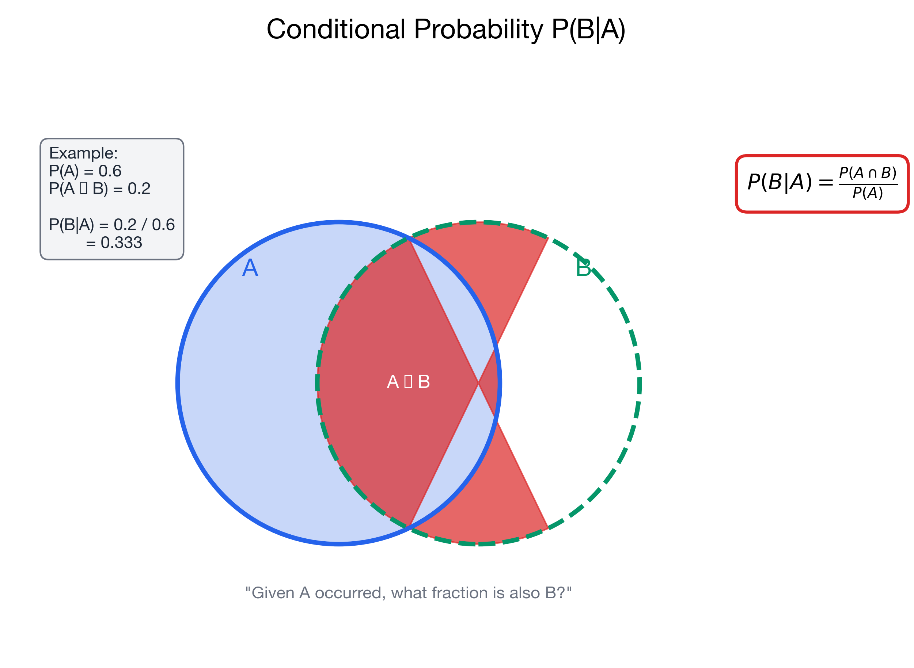

# I can calculate conditional probabilities

> 📚 **Overview:** Conditional probability is the probability of an event given that another event has occurred—essential for Bayes' theorem.

---

## 📑 Table of Contents

1. [Learning Objectives](#learning-objectives)
2. [Key Concepts](#key-concepts)
3. [Worked Example](#worked-example)
4. [Practice Problems](#practice-problems)
5. [Law of Total Probability](#law-of-total-probability)
6. [Key Takeaways](#key-takeaways)

---

## Learning Objectives

After completing this section, you will be able to:
- Calculate conditional probabilities using the formula
- Interpret P(A|B) correctly
- Distinguish between P(A|B) and P(B|A)
- Test for independence using conditional probability

---

## Key Concepts

### Conditional Probability Formula

The probability of A given B:

$$
P(A|B) = \frac{P(A \cap B)}{P(B)}
$$

Read as: "Probability of A, given B"

### Interpretation

P(A|B) asks: "If we know B happened, what's the probability A also happened?"

We're **restricting our sample space** to only cases where B occurred.

---

### Visualizing Conditional Probability

<!-- IMAGE_PLACEHOLDER
Type: venn_diagram
Description: Venn diagram with two overlapping circles A and B. Circle B is highlighted, and the intersection A∩B is specially marked. Shows that P(A|B) is the ratio of the intersection to B's total area.
Data: Labels showing P(A|B) = P(A∩B)/P(B)
Style: B circle highlighted as the "reduced sample space"
Filename: conditional_probability_venn.png
-->

---

### Key Distinction: P(A|B) vs P(B|A)

These are generally NOT equal!

**Example:** Medical testing
- P(Positive test | Disease) = 99% (sensitivity)
- P(Disease | Positive test) = 10% (could be much lower!)

> 💡 The order matters. P(A|B) and P(B|A) answer different questions.

---

### Independence Revisited

Two events are **independent** if:

$$
P(A|B) = P(A)
$$

This means knowing B gives no information about A.

**Equivalently:**

$$
P(A \cap B) = P(A) \cdot P(B)
$$

---

## Worked Example

**Problem:**
A company surveys 200 employees about job satisfaction and department.

|  | Satisfied | Not Satisfied | Total |
|--|-----------|---------------|-------|
| Sales | 45 | 15 | 60 |
| Engineering | 60 | 20 | 80 |
| Marketing | 35 | 25 | 60 |
| **Total** | 140 | 60 | 200 |

Calculate:
a) P(Satisfied | Marketing)
b) P(Engineering | Not Satisfied)
c) Are Satisfaction and Department independent?

**Solution:**

### Part a: P(Satisfied | Marketing)

$$P(\text{Sat}|\text{Mkt}) = \frac{P(\text{Sat} \cap \text{Mkt})}{P(\text{Mkt})}$$

From the table:
- P(Sat ∩ Mkt) = 35/200 = 0.175
- P(Mkt) = 60/200 = 0.30

$$P(\text{Sat}|\text{Mkt}) = \frac{0.175}{0.30} = 0.583$$

Or directly: 35 out of 60 Marketing employees are satisfied = 35/60 = **58.3%**

### Part b: P(Engineering | Not Satisfied)

$$P(\text{Eng}|\text{Not Sat}) = \frac{\text{Not Satisfied Engineers}}{\text{All Not Satisfied}}$$

$$P(\text{Eng}|\text{Not Sat}) = \frac{20}{60} = 0.333 = \text{33.3\%}$$

### Part c: Independence Check

If independent: P(Sat|Dept) should be the same for all departments.

- P(Sat|Sales) = 45/60 = 75%
- P(Sat|Eng) = 60/80 = 75%
- P(Sat|Mkt) = 35/60 = 58.3%

**Marketing differs!** So satisfaction and department are **NOT independent**.

---

## Practice Problems

### Problem 1

A deck of 52 cards. You draw one card.
a) P(King | Face card)
b) P(Face card | King)
c) P(Heart | Red card)

💡 Show Solution

**a) P(King | Face card)**
Face cards: Jack, Queen, King = 12 cards (3 per suit × 4 suits)
Kings: 4 cards
$$P(\text{King}|\text{Face}) = \frac{4}{12} = \frac{1}{3} = 0.333$$

**b) P(Face card | King)**
If we know it's a King, it's definitely a face card!
$$P(\text{Face}|\text{King}) = 1$$

Note: P(King|Face) ≠ P(Face|King)

**c) P(Heart | Red card)**
Red cards: Hearts (13) + Diamonds (13) = 26
Hearts: 13
$$P(\text{Heart}|\text{Red}) = \frac{13}{26} = 0.5$$

---

### Problem 2

In a factory, 5% of products are defective. The quality control test:
- Correctly identifies 98% of defective products (sensitivity)
- Correctly identifies 95% of non-defective products (specificity)

A product tests positive. What's the probability it's actually defective?

💡 Show Solution

This is P(Defective | Positive test). Let's use a contingency table approach.

**Given:**
- P(D) = 0.05, P(D') = 0.95
- P(+|D) = 0.98 (true positive rate)
- P(-|D') = 0.95, so P(+|D') = 0.05 (false positive rate)

**Create table for 10,000 products:**

|  | Defective (500) | Not Defective (9,500) | Total |
|--|-----------------|----------------------|-------|
| Test + | 0.98 × 500 = 490 | 0.05 × 9,500 = 475 | 965 |
| Test - | 10 | 9,025 | 9,035 |

$$P(\text{Defective}|\text{Positive}) = \frac{490}{965} = 0.508 = 50.8\%$$

**Answer:** Only about 51% of positive tests are truly defective!

This is why this is called the "base rate fallacy" - the low base rate (5%) matters a lot.

---

### Problem 3

Events A and B have: P(A) = 0.4, P(B) = 0.5, P(A∩B) = 0.2

a) Calculate P(A|B) and P(B|A)
b) Are A and B independent?

💡 Show Solution

**a) Conditional probabilities:**

$$P(A|B) = \frac{P(A \cap B)}{P(B)} = \frac{0.2}{0.5} = 0.4$$

$$P(B|A) = \frac{P(A \cap B)}{P(A)} = \frac{0.2}{0.4} = 0.5$$

**b) Independence check:**

For independence: P(A|B) = P(A)
- P(A|B) = 0.4
- P(A) = 0.4
- They're equal! ✓

Also check: P(A) × P(B) = 0.4 × 0.5 = 0.2 = P(A∩B) ✓

**Answer: Yes, A and B are independent.**

---

## Law of Total Probability

When B can occur in one of several ways (B₁, B₂, ..., Bₙ):

$$P(A) = \sum_{i=1}^{n} P(A|B_i) \cdot P(B_i)$$

**Example:** Probability of being late when:
- Taking bus (40% of days): 15% late
- Taking train (60% of days): 5% late

$$P(\text{Late}) = P(\text{Late}|\text{Bus}) \cdot P(\text{Bus}) + P(\text{Late}|\text{Train}) \cdot P(\text{Train})$$
$$P(\text{Late}) = 0.15 \times 0.40 + 0.05 \times 0.60 = 0.06 + 0.03 = 0.09$$

---

## Common Mistakes to Avoid

> ⚠️ **Mistake 1:** Confusing P(A|B) with P(B|A).
> "Probability of disease given positive test" ≠ "Probability of positive test given disease"

> ⚠️ **Mistake 2:** Forgetting to restrict the sample space.
> When given B, only count outcomes within B.

> ⚠️ **Mistake 3:** Ignoring base rates.
> Even accurate tests can give many false positives when the base rate is low.

---

## Key Takeaways

> 🎯 **Remember:**
> - **P(A|B)** = probability of A given B has occurred
> - **Formula:** P(A|B) = P(A∩B) / P(B)
> - **Order matters:** P(A|B) ≠ P(B|A) generally
> - **Independence:** P(A|B) = P(A) means A and B are independent
> - **Law of Total Probability:** Useful when you know conditional probabilities

---

## Navigation

[← Probability Rules](probability_rules.md) | [Module Index](index.md) | [Next: Bayes' Theorem →](bayes_theorem.md)

**Related Reference:** [Formula Glossary](../reference/formula_glossary.md)

