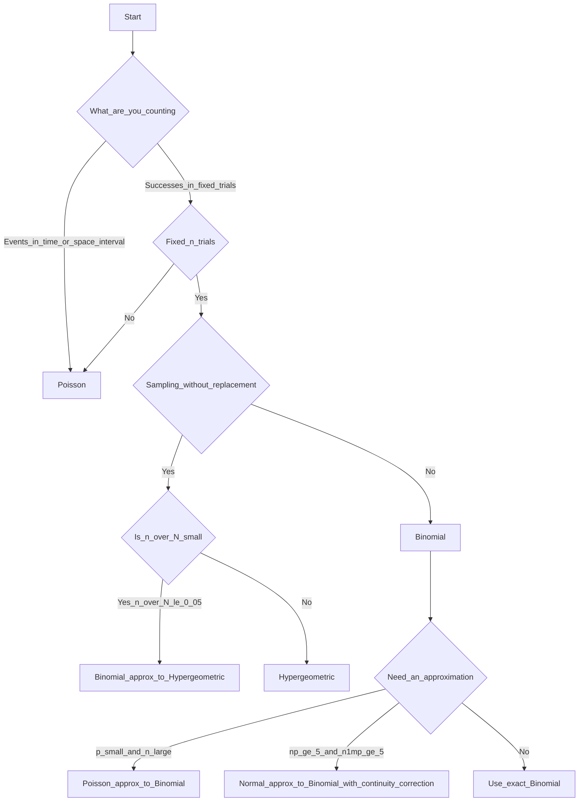

# I can choose the right discrete distribution

> 📚 **Overview:** A decision guide for selecting between Binomial, Poisson, and Hypergeometric distributions—know which to use when.

---

## 📑 Table of Contents

1. [Learning Objectives](#learning-objectives)
2. [Quick Decision Flowchart](#quick-decision-flowchart)
3. [Comparison Table](#comparison-table)
4. [Practice Problems](#practice-problems)
5. [Key Takeaways](#key-takeaways)

---

## Learning Objectives

After completing this section, you will be able to:
- Quickly identify which distribution applies to a problem
- Understand the key distinguishing features of each distribution
- Recognize when distributions can approximate each other

---

## Quick Decision Flowchart

<!-- IMAGE_PLACEHOLDER
Type: flowchart
Description: Decision tree for choosing discrete distributions. Start: "What are you counting?" Branch 1: "Successes in fixed trials" → Binomial. Branch 2: "Events in an interval" → Poisson. Branch 3: "Successes from finite population without replacement" → Hypergeometric. Additional decision points for n < 5% of N leading to Binomial approximation.
Data: Three endpoints with decision criteria
Style: Clean flowchart with colored endpoints
Filename: discrete_distribution_flowchart.png
-->

### Printable flowchart (text)

---

## Decision Questions

Ask these questions in order:

### Question 1: Fixed number of trials or events in an interval?

| Answer | Go to |
|--------|-------|
| Fixed number of trials | Question 2 |
| Events in a continuous interval | **POISSON** |

### Question 2: Sampling with or without replacement?

| Answer | Distribution |
|--------|-------------|
| With replacement (or large population) | **BINOMIAL** |
| Without replacement (small population) | **HYPERGEOMETRIC** |

---

## Side-by-Side Comparison

| Feature | Binomial | Poisson | Hypergeometric |
|---------|----------|---------|----------------|
| **What you count** | Successes in n trials | Events in interval | Successes from population |
| **Trials/interval** | Fixed n trials | Fixed interval | Fixed n draws |
| **Independence** | Yes | Yes | No (dependent draws) |
| **Replacement** | Yes (or large N) | N/A | No |
| **Parameters** | n, p | λ | N, K, n |
| **Mean** | np | λ | n(K/N) |
| **Variance** | np(1-p) | λ | Smaller than Binomial |

---

## Recognizing Each Distribution

### Binomial Keywords
- "Fixed number of trials"
- "Each trial is success/failure"
- "Independent trials"
- "Same probability each time"
- "n attempts/customers/items tested"

**Example:** "A salesperson makes 10 calls. Each has 30% success rate."

---

### Poisson Keywords
- "Average rate per..."
- "In the next hour/day/month..."
- "Events occurring randomly"
- "Average of λ per interval"
- "How many in a given period"

**Example:** "A store receives an average of 5 customers per hour."

---

### Hypergeometric Keywords
- "Without replacement"
- "Finite population of N"
- "Contains K special items"
- "Select n from the population"
- "Small population relative to sample"

**Example:** "Draw 5 cards from a deck of 52."

---

## Practice: Match the Distribution

### Scenario 1
A basketball player has a 70% free throw success rate. She attempts 8 free throws. What's the probability of making exactly 6?

💡 Show Answer

**BINOMIAL**
- Fixed trials: n = 8
- Two outcomes: make or miss
- Constant probability: p = 0.70
- Independent: each shot is independent

---

### Scenario 2
Typos occur in a newspaper at a rate of 2 per page. What's the probability of exactly 3 typos on the next page?

💡 Show Answer

**POISSON**
- Events (typos) in interval (one page)
- Known rate: λ = 2 per page
- No fixed number of "trials"

---

### Scenario 3
A box has 20 light bulbs, 5 of which are defective. You select 4 bulbs. What's the probability exactly 1 is defective?

💡 Show Answer

**HYPERGEOMETRIC**
- Finite population: N = 20
- Without replacement (selecting from a box)
- K = 5 defective, n = 4 selected, k = 1 desired

---

### Scenario 4
In a large city, 10% of drivers run red lights. A camera photographs 50 drivers. What's the probability 8 or more ran the red light?

💡 Show Answer

**BINOMIAL**
- Fixed trials: n = 50
- Two outcomes: run red or not
- p = 0.10 (constant)
- Large population → effectively with replacement

---

### Scenario 5
Accidents occur on a highway at a rate of 0.5 per day. What's the probability of no accidents in the next 3 days?

💡 Show Answer

**POISSON**
- Events in interval (3 days)
- Rate: λ = 0.5 × 3 = 1.5 per 3 days
- Count accidents in time period

---

### Scenario 6
A lottery has 1 million tickets, 100 are winners. You buy 10 tickets. What's the probability of winning at least once?

💡 Show Answer

**BINOMIAL (approximately)**

Technically Hypergeometric, but:
- n = 10 is less than 5% of N = 1,000,000
- So Binomial with p = 100/1,000,000 = 0.0001 is a good approximation

Use: P(X ≥ 1) = 1 - P(X = 0) = 1 - (0.9999)^10 ≈ 0.001

---

## Approximation Rules

### Poisson approximates Binomial when:
- You have a Binomial setting (fixed n, independent trials, constant p)
- \(p\) is small and \(n\) is large
- Common exam-friendly rule of thumb: **\(p\\le 0.05\)** and **\(\\lambda=np\\le 10\)** (often even \(np<5\) is used as a stricter rule)
- Use \(\\lambda=np\\) and compute using Poisson(\(\\lambda\))

### Normal approximates Binomial when:

- You have a Binomial setting (fixed n, independent trials, constant p)
- Both \(np\\) and \(n(1-p)\\) are “large enough”
- Common exam rule: **\(np\\ge 5\\)** and **\(n(1-p)\\ge 5\\)**

If you approximate \(P(X\\le k)\\) or \(P(X\\ge k)\\), use a **continuity correction**:

- \(P(X\\le k) \\approx P(Y\\le k+0.5)\\)
- \(P(X\\ge k) \\approx P(Y\\ge k-0.5)\\)

where \(Y\\sim \\mathcal{N}(np, np(1-p))\\).

### Binomial approximates Hypergeometric when:
- n < 5% of N (sample is small relative to population)
- Use p = K/N

---

## Summary Table

| Clue in Problem | Distribution |
|-----------------|--------------|
| "n trials, p success rate" | Binomial |
| "average rate of λ per..." | Poisson |
| "select n from N without replacement" | Hypergeometric |
| "at least one" in any context | 1 - P(X=0) |
| "events in next hour/day" | Poisson |
| "defects per unit area" | Poisson |
| "committee selected from group" | Hypergeometric |

---

## Key Takeaways

- **Binomial:** Fixed trials, constant p, with replacement
- **Poisson:** Events in interval, known average rate
- **Hypergeometric:** Finite population, without replacement
- Look for keywords to identify the right distribution
- Know when approximations apply

---

## Navigation

[← Hypergeometric](hypergeometric.md) | [Module Index](index.md) | [Next: Practice Problems →](discrete_problems.md)

**Related Reference:** [Distribution Table](../reference/distribution_table.md)

