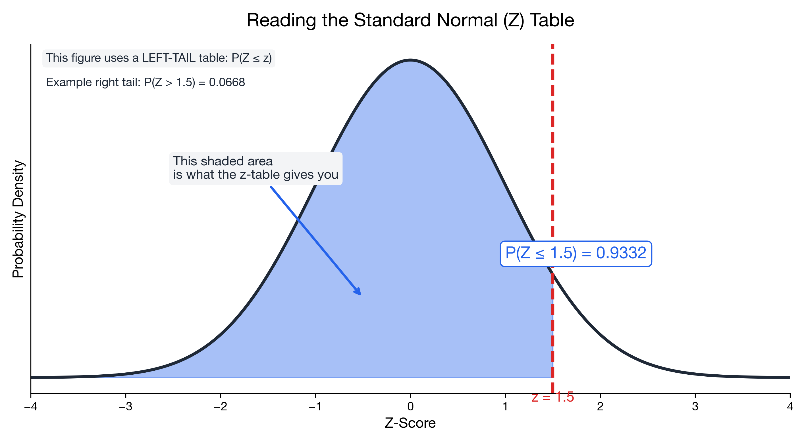

# I can find Normal probabilities

> 📚 **Overview:** Using z-tables to find areas under the normal curve—a key skill for inference.

Using z-tables to calculate probabilities for Normal distributions.

---

## Learning Objectives

After completing this section, you will be able to:
- Use z-tables to find P(Z < z)
- Calculate P(a < X < b) for any Normal distribution
- Find values corresponding to given probabilities (inverse)
- Handle "greater than" and "between" problems

---

## Key Concepts

### The Standard Normal Table

The z-table gives: **P(Z ≤ z)** — the area to the LEFT of z.

<!-- IMAGE_PLACEHOLDER
Type: chart
Description: Standard normal curve with shaded area to the left of a positive z value (e.g., z=1.5). The shaded area represents P(Z ≤ z). Arrow pointing to shaded area labeled "This is what the table gives you."
Data: Standard normal, shade left of z=1.5
Style: Clear labeling of the cumulative probability area
Filename: z_table_interpretation.png
-->

---

### Reading the Z-Table

To find P(Z ≤ 1.96):
1. Find row for 1.9
2. Find column for 0.06
3. Read intersection: **0.9750**

| z | .00 | ... | .06 | ... |
|---|-----|-----|-----|-----|
| ... | | | | |
| 1.9 | 0.9713 | ... | **0.9750** | ... |
| ... | | | | |

---

### Z-table lookup mechanics (row/column) + shortcuts

**Example 1: P(Z ≤ 0.75)**

- Row: 0.7
- Column: 0.05
- Table value: P(Z ≤ 0.75) = **0.7734**

**Example 2: P(Z ≤ -1.23) (negative z)**

If your table only lists positive z-values, use symmetry:

$$
P(Z \\le -a) = 1 - P(Z \\le a)
$$

So:

$$
P(Z \\le -1.23) = 1 - P(Z \\le 1.23)
$$

If the table gives P(Z ≤ 1.23) = 0.8907, then:

$$
P(Z \\le -1.23) = 1 - 0.8907 = 0.1093
$$

**Example 3: P(Z > 1.75) (greater-than)**

$$
P(Z > 1.75) = 1 - P(Z \\le 1.75) = 1 - 0.9599 = 0.0401
$$

---

### Four Types of Probability Problems

| Type | Method |
|------|--------|
| P(Z < a) | Look up directly |
| P(Z > a) | 1 - P(Z < a) |
| P(a < Z < b) | P(Z < b) - P(Z < a) |
| P(Z < ?) = p | Inverse lookup |

---

## Worked Example

**Problem:**
SAT scores are normally distributed with μ = 1050 and σ = 200.

a) What percentage of students score below 1200?
b) What percentage score above 1400?
c) What percentage score between 900 and 1200?
d) What score is at the 90th percentile?

**Solution:**

### Part a: P(X < 1200)

**Step 1:** Convert to z-score
$$z = \frac{1200 - 1050}{200} = \frac{150}{200} = 0.75$$

**Step 2:** Look up P(Z < 0.75)
From z-table: P(Z < 0.75) = 0.7734

**Answer: 77.34%** score below 1200.

---

### Part b: P(X > 1400)

**Step 1:** Convert to z-score
$$z = \frac{1400 - 1050}{200} = \frac{350}{200} = 1.75$$

**Step 2:** Look up P(Z < 1.75)
From z-table: P(Z < 1.75) = 0.9599

**Step 3:** Use complement
P(Z > 1.75) = 1 - 0.9599 = 0.0401

**Answer: 4.01%** score above 1400.

---

### Part c: P(900 < X < 1200)

**Step 1:** Convert both to z-scores
$$z_1 = \frac{900 - 1050}{200} = -0.75$$
$$z_2 = \frac{1200 - 1050}{200} = 0.75$$

**Step 2:** Look up both probabilities
P(Z < -0.75) = 0.2266
P(Z < 0.75) = 0.7734

**Step 3:** Subtract
P(-0.75 < Z < 0.75) = 0.7734 - 0.2266 = 0.5468

**Answer: 54.68%** score between 900 and 1200.

---

### Part d: 90th Percentile

**Step 1:** Find z for which P(Z < z) = 0.90
From z-table (inverse lookup): z ≈ 1.28

**Step 2:** Convert back to raw score
$$x = \mu + z \cdot \sigma = 1050 + 1.28 \times 200 = 1050 + 256 = 1306$$

**Answer:** The 90th percentile is **1306**.

---

## Practice Problems

### Problem 1

Weights of packages are normally distributed with μ = 500g and σ = 20g.

a) What percentage weigh less than 480g?
b) What percentage weigh more than 540g?
c) What weight is exceeded by only 5% of packages?

💡 Show Solution

**a) P(X < 480):**
z = (480 - 500) / 20 = -1.0
P(Z < -1.0) = 0.1587
**Answer: 15.87%**

**b) P(X > 540):**
z = (540 - 500) / 20 = 2.0
P(Z > 2.0) = 1 - 0.9772 = 0.0228
**Answer: 2.28%**

**c) 95th percentile (only 5% above):**
z for 0.95 = 1.645
x = 500 + 1.645 × 20 = 500 + 32.9 = 532.9g
**Answer: About 533g**

---

### Problem 2

Test scores have μ = 75 and σ = 10. Grades are assigned as:
- A: Top 10%
- B: Next 25%
- C: Next 30%
- D: Next 25%
- F: Bottom 10%

Find the cutoff scores for each grade.

💡 Show Solution

**Find percentile cutoffs:**
- A: Above 90th percentile
- B: 65th to 90th percentile  
- C: 35th to 65th percentile
- D: 10th to 35th percentile
- F: Below 10th percentile

**Cutoff z-scores and scores:**

| Percentile | z | Score = 75 + z(10) |
|------------|---|---------------------|
| 90th | 1.28 | 87.8 ≈ 88 |
| 65th | 0.39 | 78.9 ≈ 79 |
| 35th | -0.39 | 71.1 ≈ 71 |
| 10th | -1.28 | 62.2 ≈ 62 |

**Grade cutoffs:**
- A: 88 and above
- B: 79 to 87
- C: 71 to 78
- D: 62 to 70
- F: Below 62

---

### Problem 3

The time to complete a task is normally distributed with μ = 30 minutes and σ = 5 minutes.

a) What's the probability of finishing in under 25 minutes?
b) What's the probability of finishing between 28 and 35 minutes?
c) 95% of people finish within what time?

💡 Show Solution

**a) P(X < 25):**
z = (25 - 30) / 5 = -1.0
P(Z < -1.0) = 0.1587
**Answer: 15.87%**

**b) P(28 < X < 35):**
z₁ = (28 - 30) / 5 = -0.4 → P = 0.3446
z₂ = (35 - 30) / 5 = 1.0 → P = 0.8413
P(28 < X < 35) = 0.8413 - 0.3446 = 0.4967
**Answer: 49.67%**

**c) 95th percentile:**
z = 1.645
x = 30 + 1.645 × 5 = 38.2 minutes
**Answer: 95% finish within 38.2 minutes**

---

## Common Z-Values to Memorize

| Cumulative Prob | z |
|----------------|---|
| 0.025 | -1.96 |
| 0.05 | -1.645 |
| 0.10 | -1.28 |
| 0.50 | 0 |
| 0.90 | 1.28 |
| 0.95 | 1.645 |
| 0.975 | 1.96 |
| 0.99 | 2.33 |

---

## Common Mistakes to Avoid

> ⚠️ **Mistake 1:** Looking up negative z incorrectly.
> Some tables only show positive z. Use symmetry: P(Z < -a) = 1 - P(Z < a).

> ⚠️ **Mistake 2:** Forgetting to standardize.
> Always convert to z before using the table.

> ⚠️ **Mistake 3:** Not drawing a picture.
> Sketch the curve and shade the area you want.

---

## Key Takeaways

- Z-table gives P(Z ≤ z) — left tail probability
- For P(Z > z): use 1 - P(Z < z)
- For P(a < Z < b): subtract P(Z < a) from P(Z < b)
- For inverse problems: look up z, then convert to x
- **Always sketch the problem!**

---

## Quick Check

1) If the table gives P(Z ≤ 1.75) = 0.9599, what is P(Z > 1.75)?
2) Use symmetry: if P(Z ≤ 1.23) = 0.8907, what is P(Z ≤ −1.23)?
3) Fill in the blank: P(a < Z < b) = P(Z < ___) − P(Z < ___).

Answers

1) 1 − 0.9599 = 0.0401.
2) 1 − 0.8907 = 0.1093.
3) b; a.

---

## Navigation

[← Z-Scores](z_scores.md) | [Module Index](index.md) | [Next: Exponential Distribution →](exponential.md)

**Related Reference:** [Statistical Tables](../reference/statistical_tables.md)

