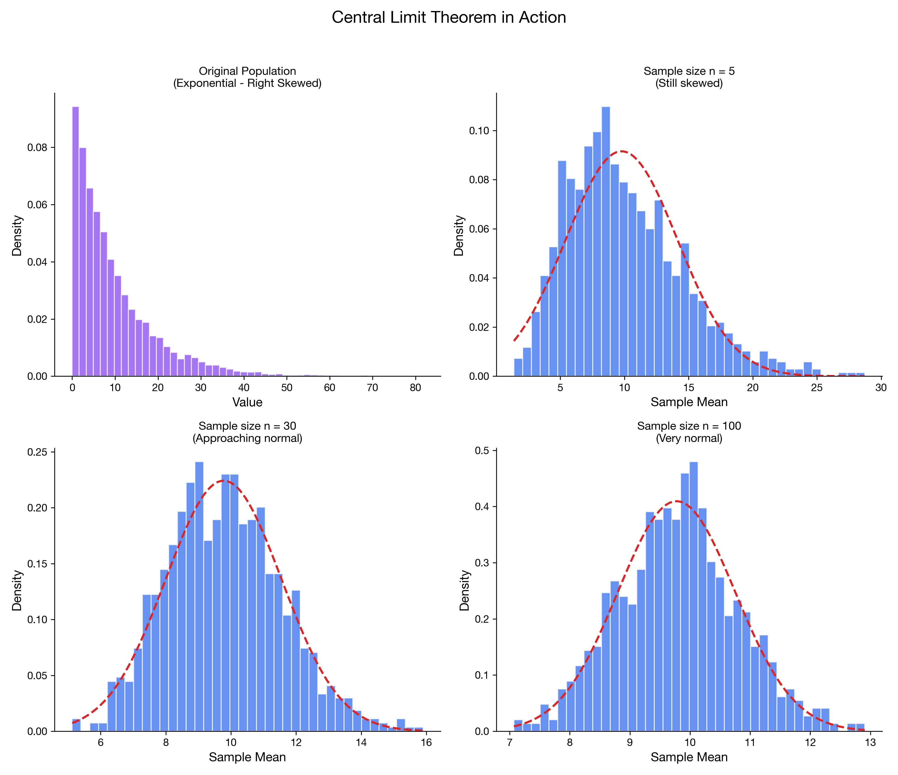

# I can apply the Central Limit Theorem

> 📚 **Overview:** The most important theorem in statistics—sample means are approximately normal for large n.

The Central Limit Theorem is one of the most important results in statistics.

---

## Learning Objectives

After completing this section, you will be able to:
- State the Central Limit Theorem
- Apply it to find probabilities about sample means
- Know when CLT applies

---

## Key Concepts

### The Central Limit Theorem (CLT)

> For a random sample of size n from a population with mean μ and standard deviation σ, the sampling distribution of the sample mean $\bar{x}$ approaches a Normal distribution as n gets large.

$$
\bar{x} \sim N\left(\mu, \frac{\sigma^2}{n}\right)
$$

Or equivalently:

$$
\frac{\bar{x} - \mu}{\sigma/\sqrt{n}} \sim N(0, 1)
$$

---

### When Does CLT Apply?

| Population Shape | Required Sample Size |
|-----------------|---------------------|
| Normal | Any n (exact) |
| Slightly skewed | n ≥ 15 |
| Moderately skewed | n ≥ 30 |
| Heavily skewed | n ≥ 50+ |

> 💡 **Rule of thumb:** n ≥ 30 is usually sufficient for CLT to apply.

---

### Why CLT is Amazing

The CLT works **regardless of the shape of the original population**. Even if the population is:
- Skewed
- Bimodal
- Uniform

The distribution of sample means will be approximately Normal for large n!

<!-- IMAGE_PLACEHOLDER
Type: multi_chart
Description: Four panels showing: (1) Original skewed population distribution, (2) Sampling distribution for n=5 (still skewed), (3) Sampling distribution for n=30 (approximately normal), (4) Sampling distribution for n=100 (very normal). Title: "CLT in Action"
Data: Simulated from skewed population
Style: Side-by-side panels showing progression toward normality
Filename: clt_demonstration.png
-->

---

## Worked Example

**Problem:**
A company's shipping times have a mean of 5 days with a standard deviation of 2 days. The distribution is right-skewed.

a) For a sample of 36 shipments, what is the probability that the mean shipping time exceeds 5.5 days?
b) How large should n be to apply CLT?

**Solution:**

### Part a: P($\bar{x}$ > 5.5)

**Step 1:** Check CLT applies
n = 36 ≥ 30, so CLT applies (sampling distribution is approximately Normal)

**Step 2:** Calculate standard error

$$
SE = \frac{\sigma}{\sqrt{n}} = \frac{2}{\sqrt{36}} = \frac{2}{6} = 0.333
$$

**Step 3:** Find z-score

$$
z = \frac{\bar{x} - \mu}{SE} = \frac{5.5 - 5}{0.333} = \frac{0.5}{0.333} = 1.5
$$

**Step 4:** Find probability
P(Z > 1.5) = 1 - P(Z < 1.5) = 1 - 0.9332 = 0.0668

**Answer: 6.68%** probability that mean shipping time exceeds 5.5 days.

### Part b: Sample size
Since the distribution is described as "right-skewed," n ≥ 30 should be sufficient.

---

## Practice Problems

### Problem 1

Annual incomes in a city have μ = CHF 65,000 and σ = CHF 15,000. The distribution is right-skewed.

For a random sample of n = 100 residents:
a) What is the mean and standard error of the sampling distribution?
b) What is P($\bar{x}$ > CHF 67,000)?

💡 Show Solution

**a) Mean and SE:**
- Mean: μ = CHF 65,000
- SE = 15,000/√100 = 15,000/10 = CHF 1,500

**b) P(x̄ > 67,000):**

$$
z = \frac{67,000 - 65,000}{1,500} = \frac{2,000}{1,500} = 1.33
$$

P(Z > 1.33) = 1 - 0.9082 = 0.0918

**Answer: 9.18%**

---

### Problem 2

Light bulb lifetimes have μ = 1000 hours and σ = 100 hours.

a) For one bulb, can we assume Normal distribution?
b) For the mean of 50 bulbs, what distribution does $\bar{x}$ follow?
c) What is P(975 < $\bar{x}$ < 1025)?

💡 Show Solution

**a) One bulb:**
We don't know the population is Normal, so we cannot assume this.

**b) Mean of 50 bulbs:**
By CLT (n = 50 ≥ 30), $\bar{x} \sim N(1000, \frac{100^2}{50})$

**c) P(975 < $\bar{x}$ < 1025):**
SE = 100/√50 = 14.14

z₁ = (975 - 1000)/14.14 = -1.77
z₂ = (1025 - 1000)/14.14 = 1.77

P(-1.77 < Z < 1.77) = P(Z < 1.77) - P(Z < -1.77)
= 0.9616 - 0.0384 = 0.9232

**Answer: 92.32%**

---

### Problem 3 (classic: probability about \(\\bar{x}\\))

Customer wait times have mean μ = 50 seconds and standard deviation σ = 12 seconds. For samples of size n = 36, compute:

$$
P(\\bar{X} < 47)
$$

💡 Show Solution

SE \(=\\sigma/\\sqrt{n}=12/\\sqrt{36}=12/6=2\\).

$$
z = \\frac{47-50}{2} = -1.5
$$

So:

$$
P(\\bar X<47)=P(Z<-1.5)=0.0668
$$

---

### Problem 4 (interval probability)

A machine produces parts with mean length μ = 100 mm and standard deviation σ = 20 mm. For samples of size n = 25, compute:

$$
P(92 < \\bar{X} < 108)
$$

💡 Show Solution

SE \(=20/\\sqrt{25}=20/5=4\\).

$$
z_1 = \\frac{92-100}{4} = -2,\\qquad z_2 = \\frac{108-100}{4}=2
$$

$$
P(92<\\bar X<108)=P(-2<Z<2)=0.9772-0.0228=0.9544
$$

---

## Common Mistakes to Avoid

> ⚠️ **Mistake 1:** Applying CLT to individual observations.
> CLT applies to the mean (or sum) of a sample, not individual values.

> ⚠️ **Mistake 2:** Forgetting to divide σ by √n.
> The standard error is σ/√n, not σ.

> ⚠️ **Mistake 3:** Using CLT for small samples from skewed populations.
> Need n ≥ 30 (or more) for non-Normal populations.

---

## Key Takeaways

- **CLT:** Sample means are approximately Normal for large n
- Works **regardless** of population shape
- Mean of sampling distribution = μ
- Standard error = σ/√n
- Generally need n ≥ 30 for CLT

---

## Navigation

[← Sampling Distributions](sampling_distributions.md) | [Module Index](index.md) | [Next: Standard Error →](standard_error.md)

