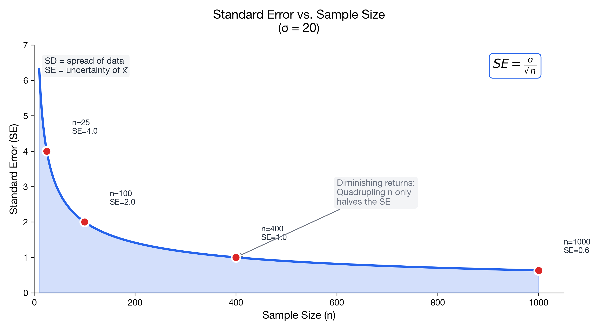

# I understand the effect of sample size

> 📚 **Overview:** Larger samples give more precise estimates—understand the √n relationship.

Sample size is one of the most important factors in statistical precision.

---

## Learning Objectives

After completing this section, you will be able to:
- Understand how sample size affects standard error
- Apply diminishing returns to sample size decisions
- Balance precision needs with practical constraints

---

## Key Concepts

### The Square Root Law

Standard error decreases with the **square root** of sample size:

$$SE = \frac{\sigma}{\sqrt{n}}$$

This creates **diminishing returns**:

| n | √n | SE (if σ = 20) | Improvement |
|---|-----|----------------|-------------|
| 25 | 5 | 4.00 | - |
| 100 | 10 | 2.00 | 50% reduction |
| 400 | 20 | 1.00 | 50% reduction |
| 1,600 | 40 | 0.50 | 50% reduction |

To halve SE, you need 4× the sample size.

---

### Visualizing the Effect

<!-- IMAGE_PLACEHOLDER
Type: chart
Description: Line graph showing SE on y-axis vs sample size n on x-axis. Curve shows steep decline initially (rapid improvement) then flattens (diminishing returns). Mark points at n=25, n=100, n=400, n=1000.
Data: SE = 20/sqrt(n) for n from 10 to 1000
Style: Clear curve with annotations for diminishing returns
Filename: se_vs_sample_size.png
-->

---

### Implications for Practice

**Initial samples give big improvements:**
- Going from n = 10 to n = 40 (4×) halves SE

**Later samples give small improvements:**
- Going from n = 1,000 to n = 4,000 only halves SE again
- Need 3,000 more observations for the same gain

**Cost-benefit analysis matters:**
- Consider the cost of additional data
- At some point, "good enough" precision is sufficient

---

## Worked Example

**Problem:**
A company wants to estimate customer satisfaction with a standard error of at most 1 point. Preliminary data suggests σ = 10.

a) What sample size is needed for SE ≤ 1?
b) What SE would they get with n = 50?
c) Is it worth going from n = 100 to n = 400?

**Solution:**

### Part a: Required n for SE ≤ 1
$$SE = \frac{\sigma}{\sqrt{n}} \leq 1$$
$$\frac{10}{\sqrt{n}} \leq 1$$
$$\sqrt{n} \geq 10$$
$$n \geq 100$$

**Answer: Need at least 100 customers.**

### Part b: SE with n = 50
$$SE = \frac{10}{\sqrt{50}} = \frac{10}{7.07} = 1.41$$

### Part c: Worth going from 100 to 400?
- n = 100: SE = 10/10 = 1.0
- n = 400: SE = 10/20 = 0.5

Going from SE = 1.0 to SE = 0.5 requires 300 additional observations.
Whether this is "worth it" depends on:
- Cost of collecting more data
- Value of the extra precision
- Decision sensitivity to the estimate

---

## Practice Problems

### Problem 1

A researcher has n = 64 and σ = 16. 

a) Current SE?
b) SE if they double to n = 128?
c) What n gives SE = 1?

💡 Show Solution

**a) Current SE:**
$$SE = \frac{16}{\sqrt{64}} = \frac{16}{8} = 2$$

**b) SE with n = 128:**
$$SE = \frac{16}{\sqrt{128}} = \frac{16}{11.31} = 1.41$$

Note: Doubling n reduces SE by factor of √2 ≈ 1.41, not half.

**c) n for SE = 1:**
$$1 = \frac{16}{\sqrt{n}}$$
$$\sqrt{n} = 16$$
$$n = 256$$

---

### Problem 2

A polling organization can survey up to 1,000 people. With p = 0.5:

a) What is SE at n = 100, 400, 1000?
b) At what point do additional surveys give little improvement?

💡 Show Solution

Using $SE = \sqrt{\frac{0.5 \times 0.5}{n}} = \frac{0.5}{\sqrt{n}}$

| n | SE | Margin of error (2×SE) |
|---|-----|----------------------|
| 100 | 0.05 (5%) | 10% |
| 400 | 0.025 (2.5%) | 5% |
| 1000 | 0.0158 (1.6%) | 3.2% |

**Diminishing returns:**
- 100 to 400: SE drops by half
- 400 to 1000: SE drops by 37%

Going beyond n = 400 gives progressively smaller improvements for the additional cost.

---

## Key Formulas Summary

| Goal | Formula |
|------|---------|
| SE from n | $SE = \frac{\sigma}{\sqrt{n}}$ |
| n from SE | $n = \left(\frac{\sigma}{SE}\right)^2$ |
| To halve SE | 4× the sample size |

---

## Key Takeaways

- SE decreases with √n, not n itself
- **Diminishing returns:** quadrupling n halves SE
- Early samples give the biggest precision gains
- Balance precision with practical constraints
- "Good enough" precision is often more efficient than "perfect"

---

## Navigation

[← Standard Error](standard_error.md) | [Module Index](index.md) | [Next Module: Estimation →](../08_estimation_confidence_intervals/index.md)

