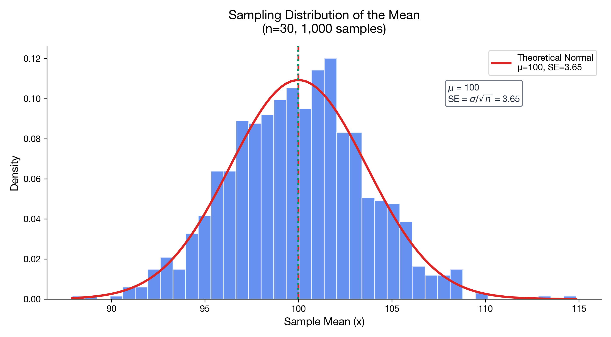

# I understand sampling distributions

> 📚 **Overview:** The distribution of a sample statistic across many samples—foundation of statistical inference.

A sampling distribution shows what happens when we take many samples.

---

## Learning Objectives

After completing this section, you will be able to:
- Define what a sampling distribution is
- Distinguish between sample statistic and sampling distribution
- Understand why sampling distributions matter for inference

---

## Key Concepts

### From Sample to Statistic

When we take a sample, we compute a **sample statistic** (like $\bar{x}$ or $\hat{p}$).

But this statistic is just ONE result. If we took a different sample, we'd get a different value.

**The sampling distribution** shows ALL the possible values the statistic could take across ALL possible samples.

---

### Visualization

Imagine taking 1000 samples of size n = 30 from a population and computing the mean of each:

<!-- IMAGE_PLACEHOLDER
Type: histogram
Description: Histogram of 1000 sample means, each from a sample of n=30. The histogram forms an approximately normal shape centered around the population mean μ, even if the original population was not normal.
Data: Simulated sample means from any distribution
Style: Bell-shaped histogram with μ marked
Filename: sampling_distribution_means.png
-->

---

### Key Properties

| Property | Symbol | Description |
|----------|--------|-------------|
| Center | $\mu_{\bar{x}} = \mu$ | Centered at population mean |
| Spread | $\sigma_{\bar{x}} = \frac{\sigma}{\sqrt{n}}$ | Smaller than population SD |
| Shape | Approximately Normal | For large n (CLT) |

---

### Why It Matters

The sampling distribution allows us to:
1. **Quantify uncertainty** in our estimates
2. **Build confidence intervals**
3. **Conduct hypothesis tests**
4. **Understand how sample size affects precision**

---

## Worked Example

**Problem:**
A population has μ = 100 and σ = 20. We take samples of size n = 25.

a) What is the mean of the sampling distribution of $\bar{x}$?
b) What is the standard deviation (standard error) of the sampling distribution?
c) If we take one sample of n = 25 and get $\bar{x} = 108$, how unusual is this?

**Solution:**

### Part a: Mean of Sampling Distribution

$$
\mu_{\bar{x}} = \mu = 100
$$

### Part b: Standard Error

$$
\sigma_{\bar{x}} = \frac{\sigma}{\sqrt{n}} = \frac{20}{\sqrt{25}} = \frac{20}{5} = 4
$$

### Part c: How unusual is x̄ = 108?

$$
z = \frac{\bar{x} - \mu}{\sigma/\sqrt{n}} = \frac{108 - 100}{4} = 2.0
$$

This is 2 standard errors above the mean. About 2.5% of samples would give a mean this high or higher.

---

## Practice Problems

### Problem 1

Test scores have μ = 75 and σ = 12. Samples of n = 36 are taken.

a) What is the mean of the sampling distribution?
b) What is the standard error?

💡 Show Solution

**a) Mean:**

$$
\mu_{\bar{x}} = \mu = 75
$$

**b) Standard Error:**

$$
\sigma_{\bar{x}} = \frac{12}{\sqrt{36}} = \frac{12}{6} = 2
$$

---

### Problem 2

Explain why the sampling distribution of means is narrower than the population distribution.

💡 Show Solution

**Answer:** Because extreme values in individual samples tend to cancel out when averaged.

- Individual observations can be very high or very low
- Sample means average these out
- The more observations averaged (larger n), the less variability
- Standard error = σ/√n gets smaller as n increases

---

## Key Takeaways

- **Sampling distribution** = distribution of a statistic across all possible samples
- Centered at the population parameter
- **Standard error** measures spread of sampling distribution
- SE decreases as sample size increases
- Foundation for all statistical inference

---

## Navigation

[← Module Index](index.md) | [Next: Central Limit Theorem →](central_limit_theorem.md)

