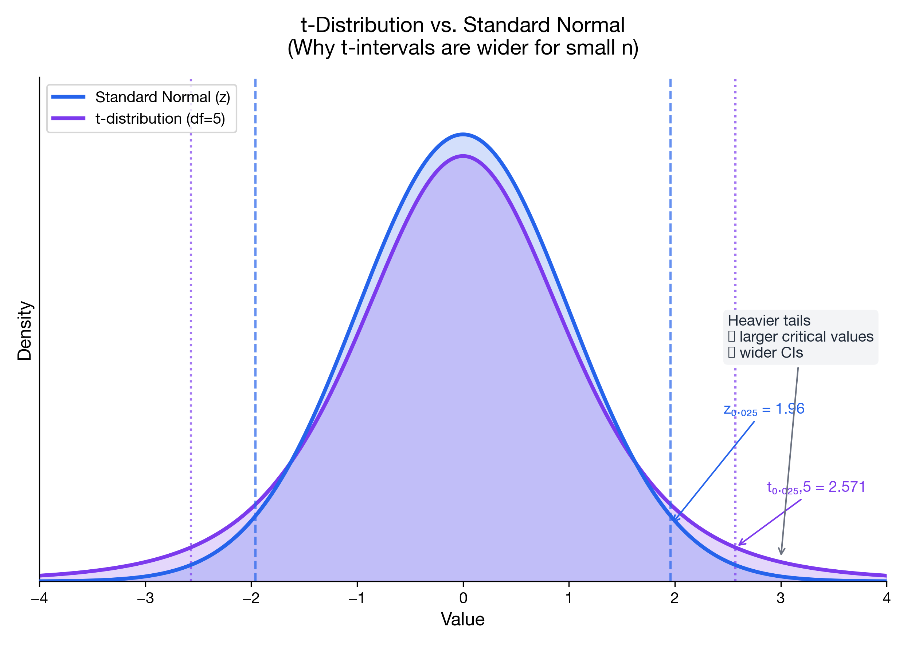

# I can construct CI for the mean

> 📚 **Overview:** Build and interpret confidence intervals for population means—with z or t depending on what's known.

Confidence intervals for the population mean.

---

## Learning Objectives

After completing this section, you will be able to:
- Construct a CI when σ is known (z-interval)
- Construct a CI when σ is unknown (t-interval)
- Choose the correct approach based on available information

---

## Key Concepts

### When to Use z vs t

| Condition | Use |
|-----------|-----|
| σ known | z-interval |
| σ unknown | t-interval |

In practice, σ is almost never known, so **t-intervals are more common**.

---

### Z-Interval (σ known)

$$
\bar{x} \pm z_{\alpha/2} \cdot \frac{\sigma}{\sqrt{n}}
$$

Common z values:
- 90% CI: z = 1.645
- 95% CI: z = 1.960
- 99% CI: z = 2.576

---

### T-Interval (σ unknown)

$$
\bar{x} \pm t_{\alpha/2, n-1} \cdot \frac{s}{\sqrt{n}}
$$

**Degrees of freedom:** df = n - 1

Look up t values in t-table.

---

## Worked Example

**Problem:**
A sample of 25 employees has mean commute time of 35 minutes with s = 10 minutes. Construct a 95% confidence interval for the true mean commute time.

**Solution:**

### Step 1: Identify the Situation
- σ unknown → Use t-interval
- n = 25, $\bar{x}$ = 35, s = 10
- Confidence level = 95%

### Step 2: Find Critical Value
df = 25 - 1 = 24
From t-table: t₀.₀₂₅,₂₄ = 2.064

### Step 3: Calculate Standard Error

$$
SE = \frac{s}{\sqrt{n}} = \frac{10}{\sqrt{25}} = \frac{10}{5} = 2
$$

### Step 4: Calculate Margin of Error

$$
ME = t_{\alpha/2} \cdot SE = 2.064 \times 2 = 4.13
$$

### Step 5: Construct Interval

$$
CI = 35 \pm 4.13 = (30.87, 39.13)
$$

**Interpretation:** We are 95% confident that the true mean commute time is between 30.87 and 39.13 minutes.

---

## Practice Problems

### Problem 1

A sample of 36 light bulbs has mean lifetime 1,000 hours with s = 100 hours. Construct a 95% CI for mean lifetime.

💡 Show Solution

**Given:** n = 36, $\bar{x}$ = 1,000, s = 100

**Step 1:** df = 35
t₀.₀₂₅,₃₅ ≈ 2.030 (from table)

**Step 2:** SE = 100/√36 = 100/6 = 16.67

**Step 3:** ME = 2.030 × 16.67 = 33.84

**Step 4:** CI = 1,000 ± 33.84 = **(966.16, 1033.84)**

We are 95% confident the mean lifetime is between 966 and 1034 hours.

---

### Problem 2

For a 90% CI with n = 16, $\bar{x}$ = 50, s = 8:

a) Find the margin of error
b) Construct the CI

💡 Show Solution

**a) Margin of Error:**
df = 15
t₀.₀₅,₁₅ = 1.753

SE = 8/√16 = 2

ME = 1.753 × 2 = **3.51**

**b) Confidence Interval:**
CI = 50 ± 3.51 = **(46.49, 53.51)**

---

### Problem 3

A researcher constructs a 95% CI and gets (12.5, 17.5). 

a) What is the sample mean?
b) What is the margin of error?
c) If she wanted a 99% CI, would it be wider or narrower?

💡 Show Solution

**a) Sample mean:**

$$
\bar{x} = \frac{12.5 + 17.5}{2} = 15
$$

**b) Margin of error:**

$$
ME = \frac{17.5 - 12.5}{2} = 2.5
$$

**c) 99% CI width:**
**Wider.** Higher confidence requires a larger critical value, which increases the margin of error.

---

## T-Table Quick Reference

| df | t₀.₀₅ (90% CI) | t₀.₀₂₅ (95% CI) | t₀.₀₀₅ (99% CI) |
|----|---------------|-----------------|-----------------|
| 10 | 1.812 | 2.228 | 3.169 |
| 20 | 1.725 | 2.086 | 2.845 |
| 30 | 1.697 | 2.042 | 2.750 |
| 60 | 1.671 | 2.000 | 2.660 |
| ∞ | 1.645 | 1.960 | 2.576 |

---

## Common Mistakes to Avoid

> ⚠️ **Mistake 1:** Using z when σ is unknown.
> If you only have s (sample SD), use t.

> ⚠️ **Mistake 2:** Wrong degrees of freedom.
> For single-sample mean, df = n - 1.

> ⚠️ **Mistake 3:** Dividing by n instead of √n.
> SE = s/√n, not s/n.

---

## Key Takeaways

- **σ known:** Use z-interval
- **σ unknown:** Use t-interval with df = n - 1
- **Formula:** $\bar{x} \pm t_{\alpha/2} \cdot \frac{s}{\sqrt{n}}$
- Higher confidence → wider interval
- Larger n → narrower interval

---

## Quick Check

1) True/False: For a 95% CI, you use \(z_{0.05}\).
2) If n increases, what happens to the standard error \(s/\\sqrt{n}\)?
3) In a one-sample t-interval, df equals ___.

Answers

1) False. For a 95% CI you use \(z_{\\alpha/2} = z_{0.025} = 1.96\) (or \(t_{0.025,df}\) if σ unknown).
2) It decreases (because √n increases).
3) df = n − 1.

## Navigation

[← Point vs Interval](point_vs_interval.md) | [Module Index](index.md) | [Next: CI for Proportion →](ci_proportion.md)

