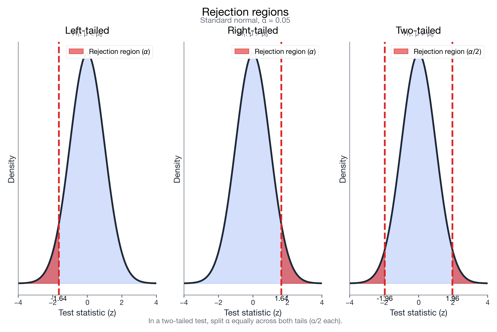

# I understand the testing framework

> 📚 **Overview:** The step-by-step process for conducting hypothesis tests—from hypotheses to conclusion.

This is the **canonical template** for hypothesis testing in this bootcamp. All later test pages follow the same structure.

---

## Learning Objectives

After completing this section, you will be able to:
- Apply the 5-step hypothesis testing procedure
- Use both critical value and p-value approaches
- Write proper conclusions

---

## Checklist (exam workflow)

Use this checklist to avoid losing easy points on HSG-style questions.

- **When to use**
  - You have a claim about a population parameter (μ or p) and sample data.
  - You must decide whether the sample provides enough evidence against H₀.
- **Assumptions (always state/verify)**
  - Random sample / representative data (or reasonable approximation)
  - Independent observations
  - Distribution condition (depends on test): Normality / large-sample condition / σ known vs unknown
- **What to report (always show)**
  1. H₀ and H₁ (H₀ contains equality)
  2. Significance level α and tail direction (one-tailed vs two-tailed; use **α/2** for two-tailed critical values)
  3. Test statistic formula → substitution → numeric value
  4. Critical value(s) **or** p-value (and how you looked it up)
  5. Decision: **Reject H₀** or **Do not reject H₀**
  6. Conclusion in context + one business interpretation sentence

---

## The 5-Step Framework

### Step 1: State Hypotheses
- Write H₀ and H₁
- Identify parameter being tested

### Step 2: Choose Significance Level
- Set α (typically 0.05)

### Step 3: Calculate Test Statistic
- Use appropriate formula
- Compare sample to hypothesized value

### Step 4: Make Decision
- **Critical value approach:** Compare test statistic to critical value
- **P-value approach:** Compare p-value to α

### Step 5: State Conclusion
- In context of the problem
- Clear statement about H₀

---

## Reusable 5-step template (copy/paste)

Show the reusable template

### Step 1: Hypotheses
- H₀: [parameter] = / ≥ / ≤ [hypothesized value]
- H₁: [parameter] ≠ / < / > [hypothesized value]

### Step 2: Significance level and tails
- α = [value]
- Tail: left / right / two-tailed (if two-tailed: use α/2 for critical values)

### Step 3: Test statistic (formula → substitution → value)
Write the formula, substitute numbers, then compute the test statistic.

### Step 4: Decision (critical value OR p-value)
- Critical value approach: compare test statistic to critical value(s)
- P-value approach: compare p-value to α
- Decision wording: **Reject H₀** / **Do not reject H₀**

### Step 5: Conclusion (in context)
At α = [value], there [is/is not] sufficient evidence to conclude that [plain language version of H₁].

Business interpretation: [one sentence about the decision/implication].

---

## Worked Example

**Problem:**
A cereal box claims to contain 500g. A sample of 36 boxes has mean 495g with s = 15g. At α = 0.05, is there evidence the boxes are underfilled?

**Solution:**

### Step 1: State Hypotheses
- H₀: μ ≥ 500 (boxes contain at least claimed amount)
- H₁: μ < 500 (boxes are underfilled)

### Step 2: Significance Level
α = 0.05 (one-tailed, left)

### Step 3: Calculate Test Statistic

$$
t = \frac{\bar{x} - \mu_0}{s/\sqrt{n}} = \frac{495 - 500}{15/\sqrt{36}} = \frac{-5}{2.5} = -2.0
$$

df = 35

### Step 4: Make Decision
**Critical value approach:**
t₀.₀₅,₃₅ = -1.690 (left-tail)
Since -2.0 < -1.690, we are in the rejection region.

**P-value approach:**
P(t₃₅ < -2.0) ≈ 0.027
Since 0.027 < 0.05, reject H₀.

### Step 5: Conclusion
At the 0.05 significance level, there is sufficient evidence to conclude that the boxes are underfilled. The mean content is significantly less than the claimed 500g.

Business interpretation: The company should investigate the filling process (underfilling risks customer complaints and regulatory issues).

---

## Practice Problems

### Problem 1

A company claims average delivery time is 3 days. A sample of 25 deliveries has mean 3.4 days with s = 0.8 days. At α = 0.05, test if delivery takes longer than claimed.

💡 Show Solution

**Step 1: Hypotheses**
- H₀: μ ≤ 3
- H₁: μ > 3 (right-tailed)

**Step 2:** α = 0.05

**Step 3: Test Statistic**

$$
t = \frac{3.4 - 3}{0.8/\sqrt{25}} = \frac{0.4}{0.16} = 2.5
$$

df = 24

**Step 4: Decision**
t₀.₀₅,₂₄ = 1.711
Since 2.5 > 1.711, reject H₀.

**Step 5: Conclusion**
There is sufficient evidence at α = 0.05 to conclude that average delivery time exceeds 3 days.

Business interpretation: The company should adjust staffing/logistics to meet the 3-day promise.

---

### Problem 2

Fill in the blanks:

If we reject H₀, we conclude that there _____ (is/isn't) sufficient evidence to _____ (reject/support) the alternative hypothesis.

💡 Show Solution

If we reject H₀, we conclude that there **is** sufficient evidence to **support** the alternative hypothesis.

---

## Writing Conclusions

**Good conclusion format:**
"At the [α] significance level, there [is/is not] sufficient evidence to conclude that [H₁ in plain language]."

**Examples:**
- "At α = 0.05, there is sufficient evidence to conclude that the mean weight is less than 500g."
- "At α = 0.01, there is not sufficient evidence to conclude that the new drug is more effective."

---

## Common mistakes to avoid (high-frequency exam traps)

> ⚠️ **Trap 1: H₀ must include equality.**
> Write H₀ with \(=\) (or ≥ / ≤). Never put “≠” in H₀.

> ⚠️ **Trap 2: Two-tailed tests use α/2 for critical values.**
> If α = 0.05 and two-tailed, each tail is 0.025.

> ⚠️ **Trap 3: Wrong degrees of freedom.**
> For a one-sample t-test: df = n − 1.

> ⚠️ **Trap 4: Mixing SD and SE.**
> Standard error is \(s/\\sqrt{n}\) (or \(\\sigma/\\sqrt{n}\)), not \(s\).

> ⚠️ **Trap 5: Wrong standard error for proportion tests.**
> In z-tests for proportions, use \(p_0\) in the standard error (not \(\\hat{p}\)).

---

## Key Takeaways

1. **State hypotheses** with H₀ containing equality
2. **Set α** before looking at data
3. **Calculate test statistic** using appropriate formula
4. **Compare** to critical value or α
5. **Conclude** in context using proper language

---

## Quick Check

1) In a two-tailed test with α = 0.05, what tail area do you use for the critical value?
2) True/False: “Do not reject H₀” means H₀ is proven true.
3) Fill in the blank: For a one-sample t-test, degrees of freedom are df = ___.

Answers

1) α/2 = 0.025 in each tail.
2) False. It means insufficient evidence to reject H₀.
3) df = n − 1.

## Navigation

[← P-Values](p_values.md) | [Module Index](index.md) | [Next: Type II Error (β) →](type_ii_error.md)

