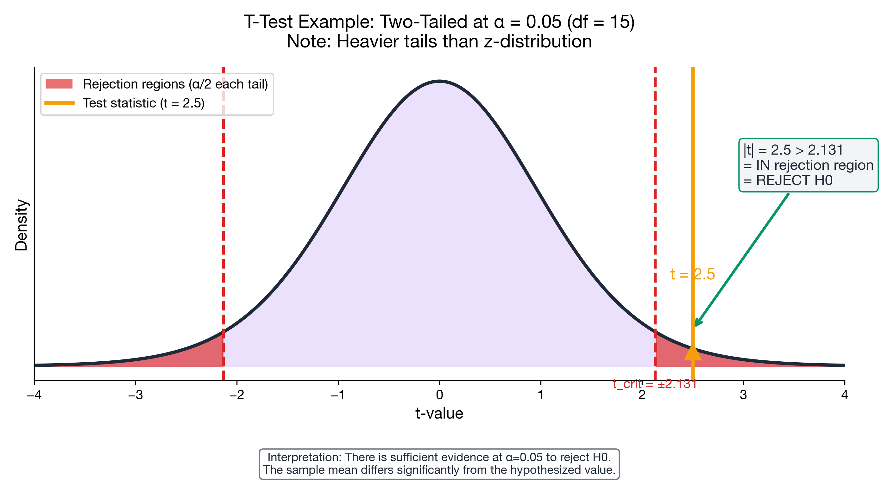

# I can perform a t-test for the mean

> 📚 **Overview:** Test hypotheses about a population mean when σ is unknown—the most common scenario.

Testing claims about a population mean when σ is unknown.

**Canonical workflow:** Review the 5-step template first: [Testing Framework](../09_hypothesis_testing_basics/testing_framework.md)

---

## Learning Objectives

After completing this section, you will be able to:
- Conduct a one-sample t-test
- Use the t-distribution with correct degrees of freedom
- Interpret results properly

---

## Checklist

- **When to use:** σ unknown (use s), random/independent sample, and you are testing a claim about μ.
- **Assumptions:** Population is approximately Normal **or** n is reasonably large (course-dependent rule of thumb).
- **What to report:** H₀/H₁, α and tail, df = n−1, t value (with substitution), critical value (or p-value), decision, conclusion in context.

---

## Key Formula

$$
t = \frac{\bar{x} - \mu_0}{s/\sqrt{n}}
$$

**Degrees of freedom:** df = n - 1

---

## Worked Example

**Problem:**
A company claims average customer wait time is 10 minutes. A sample of 16 customers has mean wait = 12.5 minutes with s = 4 minutes. At α = 0.05, is wait time significantly different from claimed?

**Solution:**

### Step 1: Hypotheses
- H₀: μ = 10
- H₁: μ ≠ 10 (two-tailed)

### Step 2: Test Statistic

$$
t = \frac{12.5 - 10}{4/\sqrt{16}} = \frac{2.5}{1} = 2.5
$$

df = 15

### Step 3: Critical Value
t₀.₀₂₅,₁₅ = 2.131 (two-tailed)

### Step 4: Decision
|2.5| > 2.131 → Reject H₀

### Step 5: Conclusion
At α = 0.05, there is sufficient evidence that wait time differs from 10 minutes.

Business interpretation: If longer waits harm satisfaction, the company should adjust staffing or scheduling.

---

## Practice Problems

### Problem 1

A manufacturer claims products weigh 250g. Sample of 25 products: mean = 248g, s = 6g. At α = 0.01, test if products are underweight.

💡 Show Solution

**Step 1: Hypotheses**
- H₀: μ ≥ 250
- H₁: μ < 250 (left-tailed)

**Step 2: Significance level**
α = 0.01 (left-tailed)

**Step 3: Test statistic**

$$
t = \frac{248 - 250}{6/\sqrt{25}} = \frac{-2}{1.2} = -1.67
$$

df = 24

**Step 4: Critical value and decision**
Critical value: t₀.₀₁,₂₄ = -2.492

Decision: -1.67 > -2.492 → Do not reject H₀

**Step 5: Conclusion**
At α = 0.01, there is insufficient evidence that products are underweight.

Business interpretation: Don’t change the production process based on this sample at such a strict α; gather more data if underweight risk is costly.

---

### Problem 2

Sample: n = 20, x̄ = 55, s = 10
Test H₀: μ = 50 vs H₁: μ ≠ 50 at α = 0.05.

💡 Show Solution

**Step 1: Hypotheses**
- H₀: μ = 50
- H₁: μ ≠ 50 (two-tailed)

**Step 2: Significance level**
α = 0.05 (two-tailed → α/2 = 0.025 per tail)

**Step 3: Test statistic**

$$
t = \frac{55 - 50}{10/\sqrt{20}} = \frac{5}{2.24} = 2.24
$$

df = 19

**Step 4: Critical value and decision**
Critical value: t₀.₀₂₅,₁₉ = 2.093

Decision: |2.24| > 2.093 → Reject H₀

**Step 5: Conclusion**
At α = 0.05, there is sufficient evidence that μ differs from 50.

Business interpretation: The process average appears different from target; management should investigate causes and adjust settings.

---

## Common Mistakes to Avoid

> ⚠️ **Mistake 1:** Using z critical values when σ is unknown.
> If σ is unknown, use the t-distribution with df = n−1.

> ⚠️ **Mistake 2:** Forgetting α/2 for two-tailed tests.
> Two-tailed critical values use α/2 in each tail.

> ⚠️ **Mistake 3:** Confusing SD and SE.
> Standard error is \(s/\\sqrt{n}\), not s.

---

## Key Takeaways

- Use t-test when σ is unknown (most common case)
- df = n - 1
- Same interpretation as z-test, just different distribution

---

## Navigation

[← Z-Test for Mean](z_test_mean.md) | [Module Index](index.md) | [Next: Z-Test for Proportion →](z_test_proportion.md)

