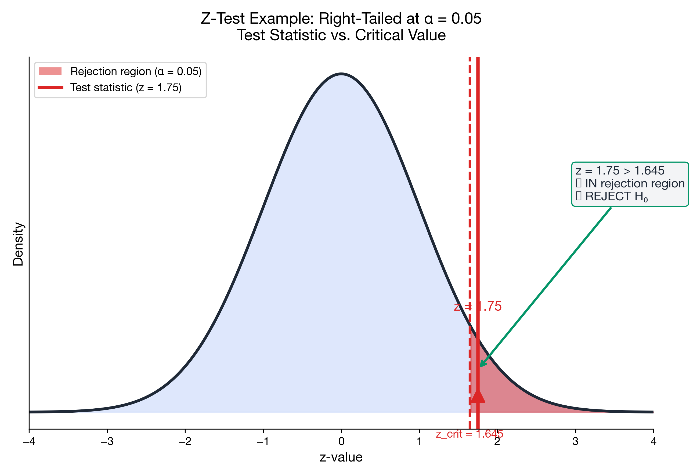

# I can perform a z-test for the mean

> 📚 **Overview:** Test hypotheses about a population mean when σ is known.

Testing claims about a population mean when σ is known.

**Canonical workflow:** Review the 5-step template first: [Testing Framework](../09_hypothesis_testing_basics/testing_framework.md)

---

## Learning Objectives

After completing this section, you will be able to:
- Set up and conduct a z-test for a mean
- Find critical values and p-values
- State conclusions properly

---

## Checklist

- **When to use:** σ is known (or given as known), random/independent sample, and you are testing a claim about μ.
- **What to report:** H₀/H₁, α and tail, z value (with substitution), critical value (or p-value), decision, conclusion in context.
- **Common trap:** Two-tailed tests use **α/2** for critical values.

---

## Key Formula

$$
z = \frac{\bar{x} - \mu_0}{\sigma/\sqrt{n}}
$$

Where:
- $\bar{x}$ = sample mean
- $\mu_0$ = hypothesized mean (from H₀)
- $\sigma$ = population standard deviation (known)
- $n$ = sample size

---

## Worked Example

**Problem:**
Historical data shows σ = 12 for test scores. A new teaching method is tested on 49 students, yielding mean = 78. The old method had μ = 75. At α = 0.05, is the new method better?

**Solution:**

### Step 1: Hypotheses
- H₀: μ ≤ 75
- H₁: μ > 75 (right-tailed)

### Step 2: Significance Level
α = 0.05 (right-tailed)

### Step 3: Test Statistic (formula → substitution → value)

$$
z = \frac{78 - 75}{12/\sqrt{49}} = \frac{3}{12/7} = \frac{3}{1.714} = 1.75
$$

### Step 4: Critical Value and Decision
z₀.₀₅ = 1.645 (right-tailed)

1.75 > 1.645 → Reject H₀

### Step 5: Conclusion
At α = 0.05, there is sufficient evidence that the new method produces higher scores.

Business interpretation: The school should consider adopting the new method if the score increase is meaningful relative to implementation cost.

---

## Practice Problems

### Problem 1

A machine fills bottles with mean 500ml and σ = 5ml. A sample of 25 bottles has mean 498.5ml. At α = 0.05, is the machine underfilling?

💡 Show Solution

**Step 1: Hypotheses**
- H₀: μ ≥ 500
- H₁: μ < 500 (left-tailed)

**Step 2: Significance level**
α = 0.05 (left-tailed)

**Step 3: Test statistic**

$$
z = \frac{498.5 - 500}{5/\sqrt{25}} = \frac{-1.5}{1} = -1.5
$$

**Step 4: Critical value and decision**
Critical value: z₀.₀₅ = -1.645

Decision: -1.5 > -1.645 → Do not reject H₀

**Step 5: Conclusion**
At α = 0.05, there is insufficient evidence that the machine is underfilling.

Business interpretation: Don’t recalibrate based on this sample alone; monitor with a larger sample if underfilling is suspected.

---

## Common Mistakes to Avoid

> ⚠️ **Mistake 1:** Using a z-test when σ is unknown.
> If σ is not known, use a one-sample t-test instead.

> ⚠️ **Mistake 2:** Forgetting the standard error \(\\sigma/\\sqrt{n}\).
> Don’t divide by σ; divide by \(\\sigma/\\sqrt{n}\).

> ⚠️ **Mistake 3:** Wrong tail (or wrong α/α/2).
> Match the tail direction to H₁. Two-tailed → use α/2.

---

## Key Takeaways

- Use z-test when σ is known
- Formula: z = (x̄ - μ₀) / (σ/√n)
- Compare z to critical value or find p-value

---

## Navigation

[← Module Index](index.md) | [Next: T-Test for Mean →](t_test_mean.md)

