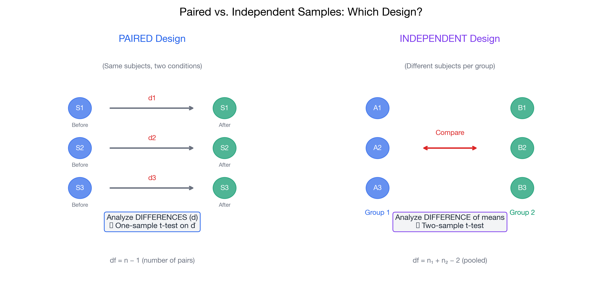

# Module 11: Two-Sample Tests

> 📚 **Overview:** Compare two groups—independent means, paired samples, and proportions.

Comparing two populations or groups.

---

## Learning Objectives

After completing this module, you will be able to:
- Conduct independent two-sample t-tests
- Conduct paired t-tests
- Test for difference in proportions
- Test for equality of variances (F-test)
- Choose the appropriate test

---

## Topics in This Module

📄 **[I can compare two independent means](independent_t_test.md)**
When samples are from different groups.

📄 **[I can compare paired samples](paired_t_test.md)**
When observations are matched or repeated.

📄 **[I can compare two proportions](two_proportion_test.md)**
Testing if proportions differ between groups.

📄 **[I can compare variances (F-test)](f_test_variance.md)**
Testing if variances are equal.

---

## Quick decision: paired vs independent (exam trap)

- **Paired** (use `paired_t_test.md`) when:
  - The same unit is measured twice (before/after), or observations are matched pairs
  - You can compute differences \(d_i\) for each pair
  - Typical workflow: convert to one sample of differences and test \(\\mu_d\\)

- **Independent** (use `independent_t_test.md`) when:
  - Group 1 and Group 2 contain different units (different people/companies/transactions)
  - There is no natural pairing between observations

If you treat paired data as independent, you often lose power and may get the wrong standard error.

## Key Formulas

| Test | Formula |
|------|---------|
| Independent t-test | $t = \frac{\bar{x}_1 - \bar{x}_2}{s_p\sqrt{\frac{1}{n_1}+\frac{1}{n_2}}}$ |
| Paired t-test | $t = \frac{\bar{d}}{s_d/\sqrt{n}}$ |
| Two-proportion z | $z = \frac{\hat{p}_1 - \hat{p}_2}{\sqrt{\hat{p}(1-\hat{p})(\frac{1}{n_1}+\frac{1}{n_2})}}$ |
| F-test | $F = \frac{s_1^2}{s_2^2}$ |

---

## Time Estimate

⏱️ **90 minutes** for this module

---

## Prerequisites

- [Module 10: One-Sample Tests](../10_one_sample_tests/index.md)

---

## Navigation

[← Previous: One-Sample Tests](../10_one_sample_tests/index.md) | [Bootcamp Home](../00_start_here/index.md) | [Next: Regression →](../12_regression_analysis/index.md)

**Start with:** [Independent T-Test](independent_t_test.md)

