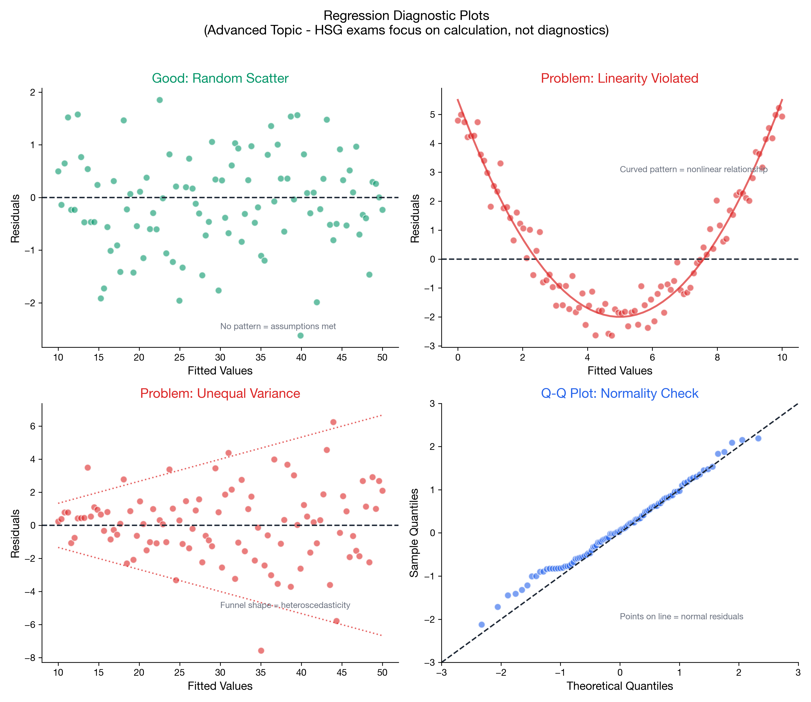

# I understand regression assumptions

> 📚 **Overview:** Linearity, independence, homoscedasticity, normality—what must hold for valid inference.

Conditions for valid regression inference.

---

## Learning Objectives

After completing this section, you will be able to:
- List the four key regression assumptions
- Understand consequences of violation
- Check assumptions using residual plots

---

## The LINE Assumptions

### L - Linearity
The relationship between X and Y is linear.
**Check:** Scatter plot shows linear pattern, residual plot shows no curve.

### I - Independence
Observations are independent.
**Check:** No pattern in residuals over time/order.

### N - Normality
Errors are normally distributed.
**Check:** Normal Q-Q plot of residuals.

### E - Equal Variance (Homoscedasticity)
Variance of errors is constant.
**Check:** Residual plot shows constant spread (no funnel shape).

---

## Visual Checks

<!-- IMAGE_PLACEHOLDER
Type: multi_chart
Description: Four panels showing residual plots: (1) Good - random scatter around zero, (2) Linearity violated - curved pattern, (3) Equal variance violated - funnel shape, (4) Normal residuals - Q-Q plot on diagonal.
Data: Simulated residual patterns
Style: Four-panel diagnostic plot
Filename: regression_diagnostics.png
-->

---

## Summary

| Assumption | Violation Sign | Consequence |
|------------|----------------|-------------|
| Linearity | Curved residuals | Biased estimates |
| Independence | Pattern in time | Invalid SE, tests |
| Normality | Non-normal Q-Q | Invalid CIs, tests |
| Equal Variance | Funnel shape | Invalid SE |

---

## Practice Problem

A residual plot shows a U-shaped pattern. Which assumption is violated?

💡 Show Solution

**Linearity** is violated.

A U-shaped pattern suggests the true relationship is curved, not linear. Consider adding a quadratic term (x²) or transforming variables.

---

## Key Takeaways

- **LINE:** Linearity, Independence, Normality, Equal variance
- Check with residual plots
- Violations invalidate tests and CIs
- Consider transformations if assumptions violated

---

## Navigation

[← Testing Coefficients](testing_coefficients.md) | [Module Index](index.md) | [Next Module: Advanced Topics →](../13_advanced_topics/index.md)

