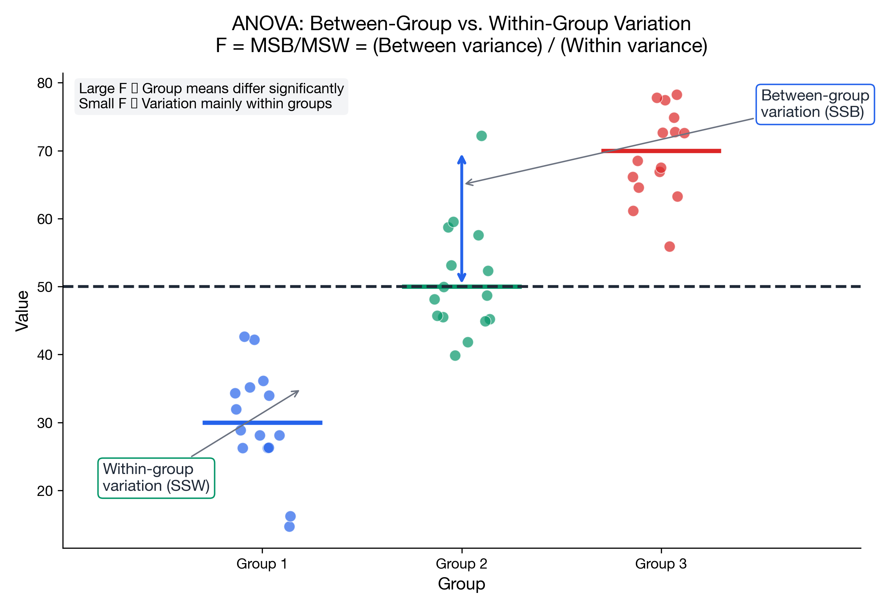
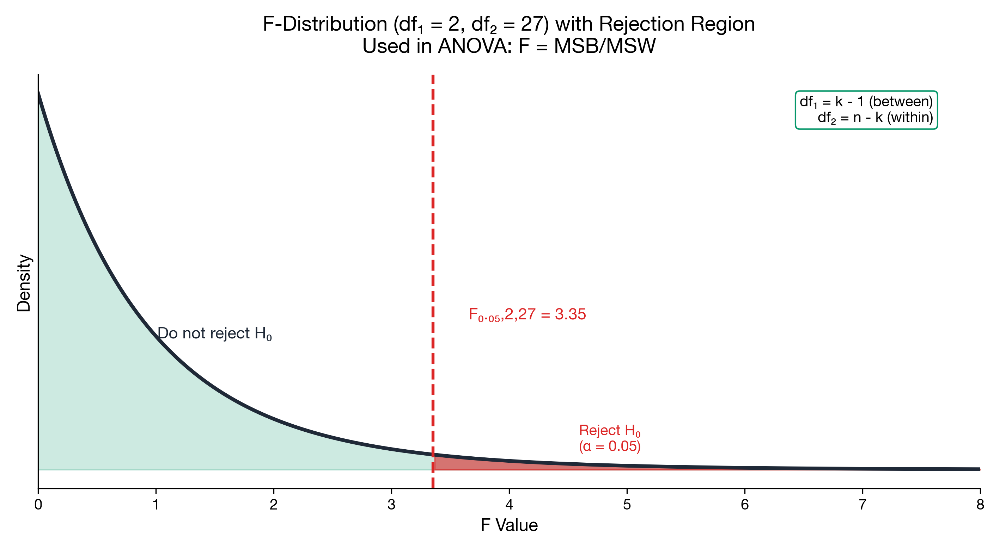

# I can perform ANOVA

> 📚 **Overview:** Compare means across three or more groups simultaneously.

Comparing means across multiple groups.

---

## Learning Objectives

After completing this section, you will be able to:
- Conduct one-way ANOVA
- Interpret the F-statistic
- Build an ANOVA table (SS, df, MS, F)

---

## Key Formulas

**F-statistic:**

$$
F = \\frac{MSB}{MSW} = \\frac{SSB/(k-1)}{SSW/(n-k)}
$$

Where:
- SSB = Between-group sum of squares
- SSW = Within-group sum of squares
- k = number of groups
- n = total sample size

---

## Hypotheses

- H₀: μ₁ = μ₂ = ... = μₖ (all means equal)
- H₁: At least one mean differs

---

## Worked Example (full ANOVA table + F-table lookup)

**Problem:**
Three teaching methods are tested on students:

| Method A | Method B | Method C |
|----------|----------|----------|
| 85 | 90 | 78 |
| 82 | 88 | 80 |
| 88 | 92 | 76 |
| 84 | 86 | 82 |

Test if methods differ at α = 0.05.

💡 Show Solution

### Step 1: Group means and overall mean

Group means:
- \(\\bar{x}_A = (85+82+88+84)/4 = 84.75\\)
- \(\\bar{x}_B = (90+88+92+86)/4 = 89.00\\)
- \(\\bar{x}_C = (78+80+76+82)/4 = 79.00\\)

Overall mean:

$$
\\bar{x} = \\frac{85+82+88+84+90+88+92+86+78+80+76+82}{12}
= \\frac{1011}{12} = 84.25
$$

### Step 2: SSB (between groups)

$$
SSB = \\sum_{j=1}^{k} n_j(\\bar{x}_j-\\bar{x})^2
$$

Here each group has \(n_j=4\\):

$$
SSB = 4(84.75-84.25)^2 + 4(89-84.25)^2 + 4(79-84.25)^2
$$

$$
= 4(0.25) + 4(22.5625) + 4(27.5625)
= 1.00 + 90.25 + 110.25
= 201.50
$$

### Step 3: SSW (within groups)

Compute squared deviations inside each group and sum them.

**Group A (mean 84.75):**

| Value | Deviation | Squared |
|---:|---:|---:|
| 85 | 0.25 | 0.0625 |
| 82 | -2.75 | 7.5625 |
| 88 | 3.25 | 10.5625 |
| 84 | -0.75 | 0.5625 |
| **Σ** |  | **18.75** |

**Group B (mean 89.00):**

| Value | Deviation | Squared |
|---:|---:|---:|
| 90 | 1 | 1 |
| 88 | -1 | 1 |
| 92 | 3 | 9 |
| 86 | -3 | 9 |
| **Σ** |  | **20.00** |

**Group C (mean 79.00):**

| Value | Deviation | Squared |
|---:|---:|---:|
| 78 | -1 | 1 |
| 80 | 1 | 1 |
| 76 | -3 | 9 |
| 82 | 3 | 9 |
| **Σ** |  | **20.00** |

So:

$$
SSW = 18.75 + 20.00 + 20.00 = 58.75
$$

### Step 4: Degrees of freedom

- \(k=3\\), \(n=12\\)
- df_between = \(k-1 = 2\\)
- df_within = \(n-k = 9\\)
- df_total = \(n-1 = 11\\)

### Step 5: Mean squares and F-statistic

$$
MSB = \\frac{SSB}{k-1} = \\frac{201.50}{2} = 100.75
$$

$$
MSW = \\frac{SSW}{n-k} = \\frac{58.75}{9} = 6.5278
$$

$$
F = \\frac{MSB}{MSW} = \\frac{100.75}{6.5278} = 15.43
$$

### Step 6: ANOVA table (exam format)

| Source | SS | df | MS | F |
|---|---:|---:|---:|---:|
| Between | 201.50 | 2 | 100.75 | 15.43 |
| Within | 58.75 | 9 | 6.5278 |  |
| Total | 260.25 | 11 |  |  |

### Step 7: Decision (F-table lookup)

Critical value (right tail):

$$
F_{0.05,2,9} \\approx 4.26
$$

Since \(15.43 > 4.26\\), **reject \(H_0\\)**.

**Conclusion:** At α = 0.05, there is sufficient evidence that at least one teaching method has a different mean result.

---

## Practice Problem

ANOVA table:

| Source | SS | df | MS | F |
|--------|-----|-----|-----|---|
| Between | 120 | 2 | ? | ? |
| Within | 180 | 27 | ? | |
| Total | 300 | 29 | | |

Calculate MS and F, test at α = 0.05.

💡 Show Solution

MSB = 120/2 = 60  
MSW = 180/27 = 6.67  
F = 60/6.67 = 9.0

F₀.₀₅,₂,₂₇ ≈ 3.35  
9.0 > 3.35 → Reject H₀

Significant differences among groups.

---

## Key Takeaways

- ANOVA compares 3+ group means
- F = between variance / within variance
- Large F → significant differences
- Follow-up with post-hoc tests to find which groups differ

---

## Navigation

[← Chi-Square](chi_square.md) | [Module Index](index.md) | [Next: Dummy Variables →](dummy_variables.md)

