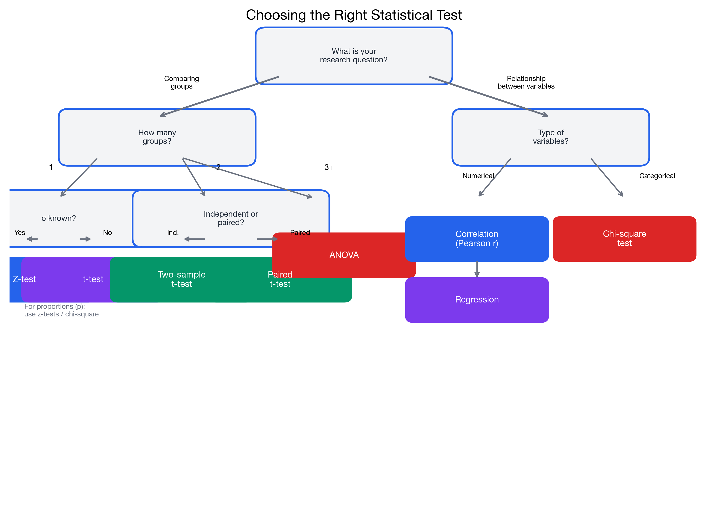

# Which Statistical Test Should I Use?

> 📚 **Overview:** Decision guide for selecting the appropriate statistical test based on your data.

A decision guide for selecting the appropriate statistical test.

---

## Quick Decision Tree

<!-- IMAGE_PLACEHOLDER
Type: flowchart
Description: Decision tree flowchart for selecting statistical tests. Start with "What are you testing?" with branches for: Means (one sample, two samples, 3+ samples), Proportions (one sample, two samples), Variances, and Categorical relationships. Each branch leads to specific tests with conditions.
Data: Include test names (z-test, t-test, paired t-test, ANOVA, chi-square, F-test)
Style: Clean flowchart with color-coded branches by test type
Filename: test_selection_flowchart.png
-->

---

## Step-by-Step Decision Process

### Step 1: What type of data are you analyzing?

| Data Type | Examples | Go to |
|-----------|----------|-------|
| **Numerical (Continuous)** | Heights, prices, scores | Step 2 |
| **Categorical** | Yes/No, Colors, Categories | Step 5 |

---

### Step 2: What parameter are you testing?

| Parameter | Go to |
|-----------|-------|
| **Mean(s)** | Step 3 |
| **Variance(s)** | Step 4 |
| **Relationship between variables** | Regression or Correlation |

---

### Step 3: Testing Means

**How many groups/samples?**

#### One Sample (comparing to a known value)
| Condition | Test |
|-----------|------|
| σ known, large n | **Z-test for mean** |
| σ unknown, any n | **One-sample t-test** |

#### Two Samples (comparing two groups)
| Condition | Test |
|-----------|------|
| Independent groups, σ known | **Two-sample z-test** |
| Independent groups, σ unknown | **Two-sample t-test** |
| Paired/matched data | **Paired t-test** |

#### Three or More Samples
| Condition | Test |
|-----------|------|
| Independent groups | **One-way ANOVA** |
| Related/blocked groups | **Repeated measures ANOVA** |

---

### Step 4: Testing Variances

| Condition | Test |
|-----------|------|
| One sample variance | **Chi-square test for variance** |
| Two sample variances | **F-test** |
| Multiple variances | **Levene's test** or **Bartlett's test** |

---

### Step 5: Categorical Data

| Question | Test |
|----------|------|
| Does distribution match expected? | **Chi-square goodness-of-fit** |
| Are two categorical variables independent? | **Chi-square test of independence** |
| Comparing one proportion to value | **Z-test for proportion** |
| Comparing two proportions | **Two-proportion z-test** |

---

## Detailed Test Selection Tables

### Tests for One Sample

| Parameter | Population σ | Sample Size | Test |
|-----------|--------------|-------------|------|
| Mean | Known | Any | Z-test |
| Mean | Unknown | n ≥ 30 | t-test (approx. z) |
| Mean | Unknown | n < 30 | t-test |
| Proportion | - | np ≥ 5, n(1-p) ≥ 5 | Z-test for proportion |
| Variance | - | Any | Chi-square test |

---

### Tests for Two Samples

| Parameter | Sample Type | Conditions | Test |
|-----------|-------------|------------|------|
| Means | Independent | σ₁, σ₂ known | Two-sample z-test |
| Means | Independent | σ₁ = σ₂ (assumed) | Pooled t-test |
| Means | Independent | σ₁ ≠ σ₂ | Welch's t-test |
| Means | Dependent/Paired | - | Paired t-test |
| Proportions | Independent | Large samples | Two-proportion z-test |
| Variances | Independent | Normal data | F-test |

---

### Tests for Multiple Samples

| Parameter | Samples | Test |
|-----------|---------|------|
| Means | 3+ independent groups | One-way ANOVA |
| Means | 3+ related groups | Repeated measures ANOVA |
| Means | 2+ factors | Two-way ANOVA |

---

## Common Scenarios and Their Tests

### Scenario 1: "Is the average different from X?"
**One-sample t-test** (or z-test if σ known)

*Example: Is the average customer satisfaction score different from 7?*

---

### Scenario 2: "Are these two groups different?"
**Two-sample t-test** (independent) or **Paired t-test** (dependent)

*Example: Do customers who received discount spend more than those who didn't?*

---

### Scenario 3: "Are these proportions different?"
**Two-proportion z-test**

*Example: Is the conversion rate higher for website A than website B?*

---

### Scenario 4: "Are these variables related?"
**Chi-square test of independence** (categorical) or **Correlation/Regression** (numerical)

*Example: Is customer satisfaction related to age group?*

---

### Scenario 5: "Do multiple groups have different means?"
**One-way ANOVA**

*Example: Do three different marketing campaigns result in different sales?*

---

### Scenario 6: "Does the data follow this distribution?"
**Chi-square goodness-of-fit**

*Example: Are customer arrivals uniformly distributed across weekdays?*

---

## Hypothesis Notation Quick Reference

| Test | H₀ | H₁ (two-tailed) |
|------|-----|-----------------|
| One-sample mean | μ = μ₀ | μ ≠ μ₀ |
| Two-sample means | μ₁ = μ₂ | μ₁ ≠ μ₂ |
| One-sample proportion | p = p₀ | p ≠ p₀ |
| Two-sample proportions | p₁ = p₂ | p₁ ≠ p₂ |
| Variance | σ² = σ₀² | σ² ≠ σ₀² |
| Independence | Variables independent | Variables related |
| ANOVA | μ₁ = μ₂ = ... = μₖ | At least one differs |

---

## Assumptions Checklist

Before using a test, verify these assumptions:

### For t-tests:
- [ ] Data is approximately normal (or n ≥ 30)
- [ ] Random sampling
- [ ] Independence of observations
- [ ] For two-sample: similar variances (or use Welch's)

### For ANOVA:
- [ ] Normality in each group
- [ ] Homogeneity of variances (similar σ²)
- [ ] Independence of observations

### For Chi-square:
- [ ] Expected frequencies ≥ 5 (typically)
- [ ] Independence of observations
- [ ] Random sampling

### For Proportions tests:
- [ ] np ≥ 5 and n(1-p) ≥ 5 (normal approximation valid)
- [ ] Random sampling
- [ ] Independence

---

## Navigation

[← Distribution Table](distribution_table.md) | [Back to Reference Index](index.md) | [Statistical Tables →](statistical_tables.md)

